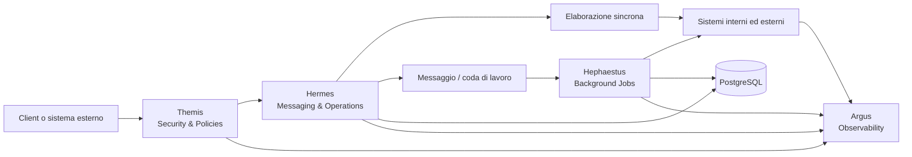
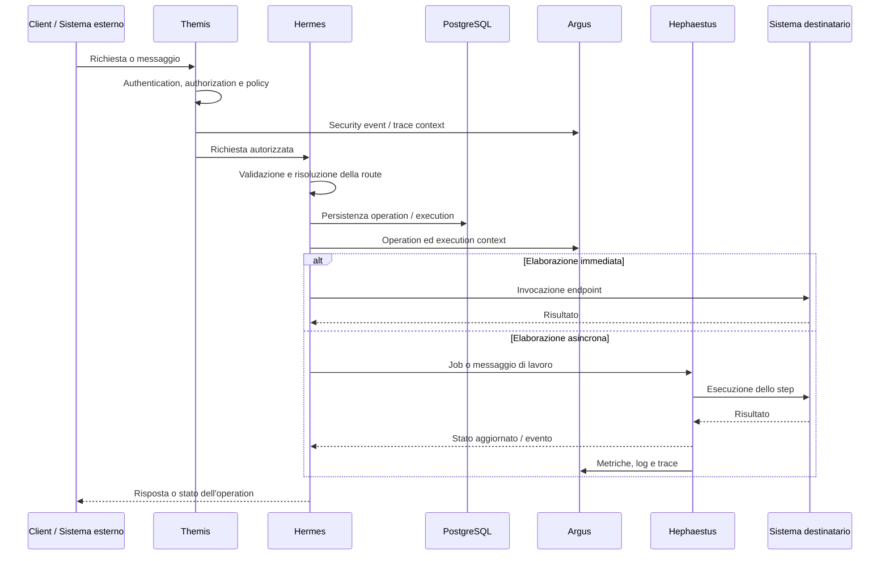

# Pantheon Operation Platform

> Piattaforma modulare per governare, instradare, eseguire e osservare operazioni tra sistemi interni, servizi esterni e processi distribuiti.

Pantheon è progettato come un gateway operativo estendibile: riceve richieste e messaggi, valida e protegge l'accesso, determina come eseguire un'operazione, coordina i processi sincroni e asincroni e rende osservabile ogni passaggio del ciclo di vita.

Il sistema è organizzato attorno a moduli con responsabilità precise. Ogni modulo prende il nome da una figura mitologica e rappresenta una capacità distinta della piattaforma:

| Modulo | Ruolo | Responsabilità principale |
|---|---|---|
| **Hermes** | Il messaggero | Ingresso, messaggistica, routing e gestione delle operazioni |
| **Hephaestus** | Il costruttore | Job background, elaborazioni asincrone e processi di esecuzione |
| **Argus** | Il vigilante | Observability, logging, metriche, tracing e controllo operativo |
| **Themis** | La legge | Authentication, authorization, policy, middleware e protezione trasversale |

> **Stato del repository:** Hermes è il modulo più avanzato ed è organizzato in `Api`, `Application`, `Domain` e `Infrastructure`, con persistenza PostgreSQL tramite Entity Framework Core. Hephaestus dispone ora di un'API ASP.NET Core e di un worker .NET separato, predisposti per l'evoluzione verso job e background processing. Argus e Themis rappresentano i moduli architetturali successivi e vengono integrati progressivamente.

## Indice

- [Pantheon Operation Platform](#pantheon-operation-platform)
  - [Indice](#indice)
  - [Obiettivi](#obiettivi)
  - [Architettura della piattaforma](#architettura-della-piattaforma)
  - [I moduli di Pantheon](#i-moduli-di-pantheon)
    - [Hermes — il messaggero](#hermes--il-messaggero)
    - [Hephaestus — background processing](#hephaestus--background-processing)
    - [Argus — observability](#argus--observability)
    - [Themis — security e governance](#themis--security-e-governance)
  - [Flusso end-to-end](#flusso-end-to-end)
  - [Struttura del repository](#struttura-del-repository)
  - [Persistenza e infrastruttura locale](#persistenza-e-infrastruttura-locale)
  - [Principi architetturali](#principi-architetturali)
  - [Stack](#stack)
  - [Sviluppo locale](#sviluppo-locale)
    - [Setup iniziale](#setup-iniziale)
    - [CLI locale](#cli-locale)
    - [Runtime locale](#runtime-locale)
    - [Database locale](#database-locale)
    - [Dev Container e debug locale](#dev-container-e-debug-locale)
    - [Struttura dei Dev Container](#struttura-dei-dev-container)
    - [Esecuzione nativa dei servizi](#esecuzione-nativa-dei-servizi)
    - [Test](#test)
  - [Roadmap](#roadmap)
  - [In sintesi](#in-sintesi)

---

## Obiettivi

Pantheon nasce per fornire un punto di coordinamento unico per operazioni distribuite e integrazioni eterogenee.

Gli obiettivi principali sono:

- esporre contratti HTTP e messaggistici coerenti;
- separare la definizione di un'operazione dalla sua esecuzione;
- instradare le operazioni verso endpoint e sistemi configurati;
- supportare esecuzioni composte da più step ordinati;
- spostare i processi lunghi o ripetibili su job background;
- mantenere correlazione e tracciabilità dall'ingresso alla conclusione;
- applicare autenticazione, autorizzazione e policy in modo uniforme;
- raccogliere log, metriche e trace senza duplicare codice nei moduli applicativi;
- mantenere il dominio indipendente da HTTP, broker, database e SDK esterni.

---

## Architettura della piattaforma



Pantheon non è pensato come un singolo blocco applicativo. È un insieme di moduli cooperanti con confini chiari:

1. **Themis** protegge la richiesta e applica le policy prima che raggiunga i casi d'uso.
2. **Hermes** riceve il messaggio o la richiesta, identifica l'operazione e determina il percorso configurato.
3. **Hephaestus** esegue i lavori differibili, lunghi o affidati a retry e scheduling.
4. **Argus** osserva il comportamento della piattaforma e collega gli eventi tramite correlation ID e operation ID.
5. I moduli condividono contratti e contesto, ma non trasferiscono la responsabilità delle proprie regole agli altri moduli.

---

## I moduli di Pantheon

### Hermes — il messaggero

Hermes è il modulo di ingresso e coordinamento delle operazioni. Rappresenta il confine tra Pantheon e i client, i sistemi esterni e i canali di messaggistica.

Le sue responsabilità comprendono:

- ricevere richieste e messaggi;
- validare i contratti in ingresso;
- identificare client, operation type ed endpoint;
- risolvere le route configurate;
- creare e gestire le operation;
- rappresentare execution, step e package;
- convertire i contratti esterni in command/query applicative;
- restituire risposte ed errori uniformi;
- persistere configurazione e stato operativo.

Nel repository Hermes è suddiviso in:

```text
Hermes
├── Hermes.Api             # HTTP, controller, request/response e gestione errori
├── Hermes.Application     # use case, command/query handler e DTO
├── Hermes.Domain          # entità, value object, stati e repository astratti
└── Hermes.Infrastructure  # EF Core, PostgreSQL, migration e repository concreti
```

Il dominio di Hermes distingue chiaramente:

- **Configuration:** `Client`, `OperationType`, `Endpoint`, `Route` e associazioni;
- **Runtime:** `Operation`, `Execution`, `ExecutionStep` e relativi tipi;
- **Payload:** `Package`, `Data`, `Header` e `Metadata`.

Una `Route` descrive un percorso configurato `Client → OperationType → Endpoint`; una `Operation` rappresenta invece una richiesta concreta ricevuta dalla piattaforma.

Per maggiori dettagli:

- [`Hermes`](src/Hermes/README.md) — visione generale del modulo e relazione tra i layer;
- [`Hermes.Api`](src/Hermes/Hermes.Api/Hermes.Api.ReadMe.md) — API HTTP, mapping, validazione ed error handling;
- [`Hermes.Application`](src/Hermes/Hermes.Application/Hermes.Application.ReadMe.md) — use case, command, query e DTO;
- [`Hermes.Domain`](src/Hermes/Hermes.Domain/Hermes.Domain.ReadMe.md) — entità, stati, invarianti e repository;
- [`Hermes.Infrastructure`](src/Hermes/Hermes.Infrastructure/Hermes.Infrastructure.ReadMe.md) — persistenza, EF Core, PostgreSQL e migration.

### Hephaestus — background processing

Hephaestus è il modulo destinato all'esecuzione in background di Pantheon. Prende in carico i lavori che non devono essere completati durante la richiesta HTTP o che richiedono controllo, retry, scheduling e gestione indipendente del ciclo di vita.

Nel repository sono già presenti:

- `Hephaestus.Api`, un servizio ASP.NET Core predisposto per esporre le capacità del modulo;
- `Hephaestus.Worker`, un processo `BackgroundService` separato dal layer HTTP;
- `Hephaestus.Application`, destinato all'orchestrazione dei casi d'uso del modulo;
- `Hephaestus.Core`, destinato ai contratti e alle astrazioni condivise;
- `Hephaestus.Infrastructure`, destinato alle implementazioni tecniche future;
- container runtime e Dev Container dedicati nell'infrastruttura locale.

L'API e il worker sono attualmente lo scheletro operativo del modulo: l'API espone ancora endpoint dimostrativi e il worker esegue un ciclo di background con logging periodico. Questa base consente di sviluppare il modulo senza confondere il processo HTTP con quello worker.

Il modulo è destinato a gestire:

- job asincroni derivati da operation ed execution step;
- code e messaggi di lavoro;
- retry e backoff;
- timeout e cancellazione;
- scheduling e differimento dell'esecuzione;
- isolamento dei processi lunghi;
- aggiornamento dello stato di execution e step;
- gestione degli errori e dei dead-letter flow;
- coordinamento con gli endpoint esterni.

Hephaestus non deve diventare il proprietario delle regole di dominio di Hermes: esegue il lavoro assegnato e comunica l'esito attraverso contratti e stati espliciti.

In Development l'API Hephaestus è configurata sui profili `http://localhost:5056` e `https://localhost:7059`. Nel runtime Docker le porte vengono invece definite negli `.env` di `infra/local`.

### Argus — observability

Argus è il sistema di osservabilità della piattaforma. Il suo scopo è rendere visibili il comportamento, le prestazioni e gli errori di Pantheon senza introdurre logica di business nei moduli osservati.

Le capacità previste includono:

- logging strutturato;
- correlation ID, operation ID ed execution ID;
- metriche tecniche e applicative;
- distributed tracing;
- durata e risultato degli step;
- conteggio di retry, errori e timeout;
- health check e readiness/liveness;
- audit degli eventi rilevanti;
- integrazione con sistemi centralizzati di monitoraggio e alerting.

Argus deve permettere di seguire una singola operazione attraverso Themis, Hermes, Hephaestus e i sistemi destinatari.

### Themis — security e governance

Themis è il modulo trasversale di protezione e governo degli accessi. Centralizza i meccanismi comuni che non devono essere implementati singolarmente nei controller o nei worker.

Le sue responsabilità comprendono:

- authentication e verifica dell'identità;
- authorization e valutazione dei permessi;
- policy applicative e tecniche;
- middleware di sicurezza;
- gestione del contesto dell'utente o del servizio chiamante;
- protezione degli endpoint HTTP e dei messaggi;
- validazione di tenant, client, scope e claim quando applicabile;
- gestione coerente degli errori di accesso;
- sicurezza dei dati sensibili e minimizzazione delle informazioni esposte.

Themis deve operare come una protezione comune della pipeline, lasciando ai singoli moduli soltanto le verifiche specifiche del proprio caso d'uso.

---

## Flusso end-to-end



La correlazione deve essere mantenuta in ogni passaggio. Gli identificativi di riferimento principali sono:

- **Correlation ID:** collega i messaggi e le richieste appartenenti allo stesso flusso;
- **Operation ID:** identifica l'operazione di business;
- **Execution ID:** identifica una specifica elaborazione;
- **Step ID:** identifica una fase dell'elaborazione.

---

## Struttura del repository

```text
PantheonOperationPlatform/
├── Pantheon.slnx
├── src/
│   ├── Hermes/
│   │   ├── Hermes.Api/             # ingresso HTTP e contratti REST
│   │   ├── Hermes.Application/     # orchestrazione dei casi d'uso
│   │   ├── Hermes.Domain/          # modello e regole di dominio
│   │   ├── Hermes.Infrastructure/  # implementazioni tecniche e persistenza
│   │   └── README.md               # panoramica del modulo Hermes
│   ├── Hephaestus/
│   │   ├── Hephaestus.Api/         # API HTTP del modulo
│   │   ├── Hephaestus.Application/ # applicazione e use case
│   │   ├── Hephaestus.Core/        # contratti e astrazioni condivise
│   │   ├── Hephaestus.Infrastructure/ # dettagli tecnici
│   │   └── Hephaestus.Worker/      # processo background
│   └── Themis/                     # security e governance in evoluzione
├── infra/
│   └── local/                      # Compose, PostgreSQL, Dockerfile e .env.example
├── scripts/
│   ├── pantheon.sh                 # comandi operativi dalla root
│   └── pantheon-debug-all.sh       # avvio e collegamento dei Dev Container
├── tests/
│   ├── Hermes.Api.Tests/           # test del layer API
│   ├── Hermes.IntegrationTests/    # test di integrazione
│   └── Hermes.UnitTests/           # test unitari
├── .devcontainer/                  # ambienti di sviluppo interattivi
└── .vscode/                        # launch e task di sviluppo locali
```

La struttura prevista per l'estensione della piattaforma è:

```text
src/
├── Hermes/       # messaggistica, routing e operazioni
├── Hephaestus/   # API, worker e background processing
├── Argus/        # logging, metriche, tracing e audit
└── Themis/       # authentication, authorization, policy e middleware
```

Ogni modulo potrà mantenere i propri layer interni, senza perdere la separazione tra API, Application, Domain/Core e Infrastructure quando applicabile.

---

## Persistenza e infrastruttura locale

La persistenza attuale di Hermes usa Entity Framework Core e PostgreSQL. `Hermes.Infrastructure` contiene `HermesDbContext`, le configurazioni Fluent API, i repository concreti e le migration dello schema.

L'ambiente locale è definito in [`infra/local/README.md`](infra/local/README.md) e include:

- PostgreSQL;
- Hermes runtime;
- Hephaestus API;
- Hephaestus Worker;
- rete Docker condivisa `pantheon-local`;
- volume persistente `pantheon-postgres-data`.

La configurazione parte dagli `.env.example` e le credenziali reali restano locali. Il volume PostgreSQL mantiene i dati tra i riavvii; per un reset completo è possibile eseguire `docker compose -f infra/local/compose.yml down -v`.

---

## Principi architetturali

1. **Modularità per capacità** — ogni divinità rappresenta una responsabilità tecnica e funzionale distinta.
2. **Clean Architecture** — il dominio non dipende da framework, database, broker o sistemi esterni.
3. **Domain-first** — invarianti e transizioni appartengono alle entità e ai value object.
4. **Controller e worker sottili** — l'ingresso HTTP e l'esecuzione background coordinano, ma non duplicano la logica applicativa.
5. **Contratti espliciti** — request, response, command, query, eventi e messaggi sono modelli distinti.
6. **Configuration ≠ Runtime** — ciò che è configurato, come route ed endpoint, è distinto da ciò che viene eseguito.
7. **Sincrono quando serve, asincrono quando conviene** — le operazioni lunghe o affidate a retry passano a Hephaestus.
8. **Security by default** — Themis applica protezioni comuni prima dell'accesso ai casi d'uso.
9. **Observability by default** — Argus riceve il contesto di correlazione e gli eventi dei moduli.
10. **Errori tipizzati e uniformi** — gli errori devono essere identificabili tramite codice, tipo e contesto.
11. **Cancellazione e resilienza** — le operazioni asincrone propagano cancellation token, timeout e segnali di stop.
12. **Nessun accoppiamento inutile** — un modulo comunica con gli altri tramite astrazioni e contratti stabili.

---

## Stack

- **Linguaggio:** C#
- **Runtime:** .NET 10 (`net10.0`)
- **Web:** ASP.NET Core MVC
- **Worker:** .NET `BackgroundService`
- **Validazione:** FluentValidation
- **API documentation:** OpenAPI e Swagger UI in Development
- **Persistenza:** Entity Framework Core, Npgsql e PostgreSQL
- **Architettura:** Clean Architecture con separazione Domain, Application, API e Infrastructure
- **Container:** Docker Compose per il runtime locale
- **Ambiente di sviluppo:** Dev Container basato su `mcr.microsoft.com/dotnet/sdk:10.0`

I dettagli dei broker, dei provider di persistenza aggiuntivi, dei sistemi di observability e dei meccanismi di identity verranno introdotti nei rispettivi moduli senza contaminare il dominio.

---

## Sviluppo locale

È necessario avere installato Docker, Docker Compose, VS Code con Dev Containers e, per l'esecuzione nativa, .NET SDK 10. In alternativa è possibile utilizzare i Dev Container del repository.

Il repository include un CLI locale 'pant' per gestire infrastruttura, container, database, log e debug.

### Setup iniziale

```bash
git clone https://github.com/VincenzoMatonti/PantheonOperationPlatform.git
cd PantheonOperationPlatform

cp infra/local/.env.example infra/local/.env
cp infra/local/postgres/.env.example infra/local/postgres/.env
cp infra/local/hermes/.env.example infra/local/hermes/.env
cp infra/local/hephaestus/.env.example infra/local/hephaestus/.env
cp infra/local/hephaestus-worker/.env.example infra/local/hephaestus-worker/.env
```

Sostituire i valori `changeMe` con porte e credenziali locali prima di avviare lo stack.

### CLI locale
Pantheon utilizza `direnv` per rendere disponibile il comando `pant` all'interno della repository.

#### Ubuntu / Debian

```bash
sudo apt update
sudo apt install direnv

direnv --version

echo 'eval "$(direnv hook bash)"' >> ~/.bashrc
source ~/.bashrc
```

#### macOS

Su macOS il metodo più comune è usare Homebrew:

```bash
brew install direnv

echo 'eval "$(direnv hook zsh)"' >> ~/.zshrc
source ~/.zshrc
```

#### Windows

`direnv` è originariamente un tool Unix-like. Il percorso consigliato su Windows è usare WSL2 con Ubuntu, oppure eseguire i comandi all'interno di Git Bash/WSL dove `direnv` è supportato correttamente. In ambiente nativo Windows, il fallback più semplice è usare gli script della repository direttamente da una shell Unix-like.

#### Abilitazione del progetto

Entrare nella root del repository:

```bash
cd ~/wa/solution/PantheonSolution
```

Il repository contiene un file `.envrc` che aggiunge `scripts/` al `PATH`:

```bash
export PATH="$PWD/scripts:$PATH"
```

La prima volta è necessario autorizzare il file:

```bash
direnv allow
```

Dopo l'autorizzazione, ogni volta che si entra nella directory del progetto `direnv` carica automaticamente `.envrc`.

Esempio di output:

```bash
direnv: loading ~/wa/solution/PantheonSolution/.envrc
direnv: export ~PATH
```

A questo punto la CLI è disponibile:

```bash
pant help
```

È quindi sufficiente:

```bash
cd ~/wa/solution/PantheonSolution
```

per avere automaticamente il comando `pant` disponibile.

Uscendo dalla directory del progetto, `direnv` rimuove automaticamente `scripts/` dal `PATH`.

Per visualizzare i comandi disponibili:

```bash
pant help
```

L'help principale fornisce i riferimenti agli help specifici:

```bash
pant local help
pant local db help
pant local shell help
pant local logs help
```

Se invece non si vuole usare `direnv`, è possibile eseguire direttamente gli script dalla root del repository con il fallback legacy:

```bash
./scripts/pantheon.sh local help
./scripts/pantheon.sh local up
./scripts/pantheon.sh local down
```

### Runtime locale
Per avviare l'intero ambiente runtime:

```bash
pant local up
```

Per fermare e rimuovere i container runtime:

```bash
pant local down
```

Per visualizzare lo stato dell'infrastruttura locale:

```bash
pant local status
```

Per seguire i log dei servizi:

```bash
pant local logs
```

Per avviare solamente PostgreSQL:

```bash
pant local db-up
```

Per fermare PostgreSQL:

```bash
pant local db-down
```

### Database locale
PostgreSQL viene eseguito in un container condiviso e contiene i database applicativi separati di Hermes e Hephaestus.

I comandi relativi al database sono disponibili tramite:

```bash
pant local db help
```

### Dev Container e debug locale
Per avviare i container di sviluppo:

```bash
pant local dev-up
```

Per fermarli:

```bash
pant local dev-down
```

Per avviare l'ambiente completo di debug:

```bash
pant local debug-all
```

`dev-up` avvia i Dev Container di Hermes, Hephaestus e Hephaestus Worker con il repository montato in `/workspace`.

`debug-all` avvia l'infrastruttura PostgreSQL necessaria, avvia i tre Dev Container, verifica che siano attivi e apre tre finestre VS Code collegate ai rispettivi container.

Ogni ambiente può essere eseguito e sottoposto a debug separatamente tramite VS Code. È quindi possibile avviare il debugger con `F5` nei singoli ambienti e impostare breakpoint indipendenti in:

- Hermes API
- Hephaestus API
- Hephaestus Worker

I tre container condividono la rete Docker locale `pantheon-local`, permettendo di eseguire e debuggare il flusso completo tra i servizi.

Per aprire manualmente un Dev Container è possibile utilizzare VS Code e scegliere **Reopen in Container** dalla relativa configurazione presente nella directory `.devcontainer`.

### Struttura dei Dev Container
Il repository utilizza un'unica configurazione Docker Compose condivisa per l'ambiente di sviluppo:

```text
.devcontainer/
├── compose.dev.yml
├── hermes/
│   ├── devcontainer.json
│   └── Dockerfile
├── hephaestus/
│   ├── devcontainer.json
│   └── Dockerfile
└── hephaestus-worker/
    ├── devcontainer.json
    └── Dockerfile
```

I Dev Container utilizzano il .NET SDK 10, montano il repository in `/workspace` e condividono la rete Docker locale con gli altri servizi Pantheon.

Nel caso in cui non si usi `direnv`, il fallback equivalente è:

```bash
./scripts/pantheon.sh local up
./scripts/pantheon.sh local dev-up
./scripts/pantheon.sh local debug-all
```

### Esecuzione nativa dei servizi

Per Hermes:

```bash
dotnet restore Pantheon.slnx
dotnet build Pantheon.slnx
dotnet run --project src/Hermes/Hermes.Api/Hermes.Api.csproj
```

In Development Hermes usa gli URL configurati nei launch settings:

- `http://localhost:5080`;
- `https://localhost:7138`;
- OpenAPI e Swagger UI sono disponibili in Development.

Per Hephaestus API:

```bash
dotnet run --project src/Hephaestus/Hephaestus.Api/Hephaestus.Api.csproj
```

L'API Hephaestus usa `http://localhost:5056` e `https://localhost:7059`. Per avviare il worker separatamente:

```bash
dotnet run --project src/Hephaestus/Hephaestus.Worker/Hephaestus.Worker.csproj
```

### Test

La solution include i progetti di test dedicati a Hermes:

```bash
dotnet test Pantheon.slnx
```

I test sono separati per responsabilità:

- `Hermes.UnitTests` per il comportamento isolato del dominio e dell'application layer;
- `Hermes.Api.Tests` per il layer HTTP;
- `Hermes.IntegrationTests` per verificare l'integrazione tra più componenti.

---

## Roadmap

L'evoluzione della piattaforma può procedere per incrementi:

1. completare le implementazioni di persistenza e integrazione di Hermes;
2. estendere Hermes a endpoint, route, execution e package oltre ai casi d'uso già esposti;
3. trasformare Hephaestus da skeleton operativo in modulo completo con job, code, retry, scheduling e gestione dei fallimenti;
4. collegare Hephaestus al ciclo di vita persistito di Hermes;
5. introdurre Argus con logging strutturato, metriche, tracing e audit correlati;
6. introdurre Themis con identity, authentication, authorization, policy e middleware;
7. definire contratti condivisi tra moduli senza condividere dettagli interni;
8. aggiungere test end-to-end sull'intero flusso di un'operation;
9. aggiungere deployment, health check, configurazione per ambiente e telemetria operativa.

---

## In sintesi

```text
Pantheon    = piattaforma complessiva
Hermes      = messaggi, routing, operation e persistenza operativa
Hephaestus  = API, worker, job e background processing
Argus       = observability e controllo operativo
Themis      = authentication, authorization, policy e middleware
```

Pantheon coordina il viaggio di un'operazione: Themis ne controlla l'accesso, Hermes la comprende, la instrada e ne persiste lo stato, Hephaestus la esegue quando il lavoro è asincrono e Argus rende ogni passaggio osservabile.
