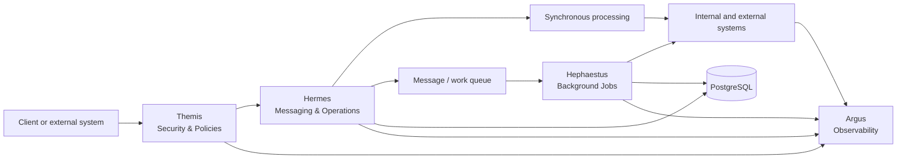
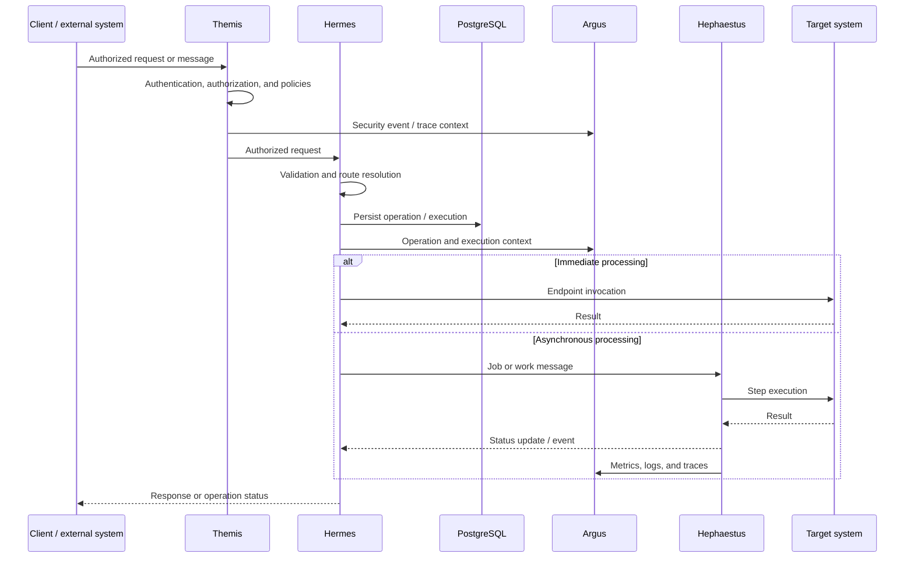

# Pantheon Operation Platform

> Modular platform to govern, route, execute, and observe operations across internal systems, external services, and distributed processes.

Pantheon is designed as an extensible operational gateway: it receives requests and messages, validates and protects access, determines how to execute an operation, coordinates synchronous and asynchronous processes, and provides visibility throughout the lifecycle.

The system is organized around modules with precise responsibilities. Each module takes the name of a mythological figure and represents a distinct capability of the platform:

| Module | Role | Primary responsibility |
|---|---|---|
| **Hermes** | The messenger | Entry, messaging, routing, and operation management |
| **Hephaestus** | The builder | Background jobs, asynchronous processing, and execution workflows |
| **Argus** | The watcher | Observability, logging, metrics, tracing, and operational control |
| **Themis** | The law | Authentication, authorization, policies, middleware, and cross-cutting protection |

> **Repository status:** Hermes is the most advanced module and is organized into `Api`, `Application`, `Domain`, and `Infrastructure`, with persistence in PostgreSQL via Entity Framework Core. Hephaestus is the next stage of the platform, while Argus and Themis are still in the conceptual and design phases.

## Table of contents

- [Pantheon Operation Platform](#pantheon-operation-platform)
  - [Table of contents](#table-of-contents)
  - [Objectives](#objectives)
  - [Platform architecture](#platform-architecture)
  - [Pantheon modules](#pantheon-modules)
    - [Hermes — the messenger](#hermes--the-messenger)
    - [Hephaestus — background processing](#hephaestus--background-processing)
    - [Argus — observability](#argus--observability)
    - [Themis — security and governance](#themis--security-and-governance)
  - [End-to-end flow](#end-to-end-flow)
  - [Repository structure](#repository-structure)
  - [Persistence and local infrastructure](#persistence-and-local-infrastructure)
  - [Architectural principles](#architectural-principles)
  - [Stack](#stack)
  - [Local development](#local-development)
    - [Initial setup](#initial-setup)
    - [Local CLI](#local-cli)
    - [Local runtime](#local-runtime)
    - [Local database](#local-database)
    - [Dev Container and local debugging](#dev-container-and-local-debugging)
    - [Structure of the Dev Containers](#structure-of-the-dev-containers)
    - [Native execution of services](#native-execution-of-services)
    - [Tests](#tests)
  - [Roadmap](#roadmap)
  - [Summary](#summary)

---

## Objectives

Pantheon was created to provide a single coordination point for distributed operations and heterogeneous integrations.

The main objectives are:

- expose consistent HTTP and messaging contracts;
- separate the definition of an operation from its execution;
- route operations to configured endpoints and systems;
- support executions composed of multiple ordered steps;
- move long-running or repeatable processes to background jobs;
- maintain correlation and traceability from entry to completion;
- apply authentication, authorization, and policies uniformly;
- collect logs, metrics, and traces without duplicating code in the application modules;
- keep the domain independent from HTTP, brokers, databases, and external SDKs.

---

## Platform architecture



Pantheon is not intended to be a single application block. It is a set of cooperating modules with clear boundaries:

1. **Themis** protects the request and applies policies before it reaches the use cases.
2. **Hermes** receives the message or request, identifies the operation, and determines the configured route.
3. **Hephaestus** executes deferrable, long-running, or retry-based jobs.
4. **Argus** observes the behavior of the platform and connects events through correlation IDs and operation IDs.
5. The modules share contracts and context, but they do not transfer responsibility for their own rules to each other.

---

## Pantheon modules

### Hermes — the messenger

Hermes is the entry and coordination module for operations. It represents the boundary between Pantheon and clients, external systems, and messaging channels.

Its responsibilities include:

- receiving requests and messages;
- validating inbound contracts;
- identifying client, operation type, and endpoint;
- resolving configured routes;
- creating and managing operations;
- representing execution, steps, and data packages;
- converting external contracts into application commands/queries;
- returning uniform responses and errors;
- persisting configuration and operational state.

Within the repository, Hermes is divided into:

```text
Hermes
├── Hermes.Api             # HTTP entry, controllers, request/response models, and error handling
├── Hermes.Application     # use case orchestration, command/query handlers, and DTOs
├── Hermes.Domain          # domain model, value objects, states, and abstract repositories
├── Hermes.Infrastructure  # EF Core, PostgreSQL, migrations, and concrete repositories
└── README.md               # overview of the Hermes module
```

The Hermes domain clearly distinguishes:

- **Configuration:** `Client`, `OperationType`, `Endpoint`, `Route`, and associated relationships;
- **Runtime:** `Operation`, `Execution`, `ExecutionStep`, and related types;
- **Payload:** `Package`, `Data`, `Header`, and `Metadata`.

A `Route` describes a configured path `Client → OperationType → Endpoint`; an `Operation` instead represents a concrete request received by the platform.

For more details:

- [`Hermes`](src/Hermes/README.md) — overview of the module and the relationship between layers;
- [`Hermes.Api`](src/Hermes/Hermes.Api/Hermes.Api.ReadMe.md) — HTTP API, mapping, validation, and error handling;
- [`Hermes.Application`](src/Hermes/Hermes.Application/Hermes.Application.ReadMe.md) — use cases, command/query handlers, and DTOs;
- [`Hermes.Domain`](src/Hermes/Hermes.Domain/Hermes.Domain.ReadMe.md) — entities, states, invariants, and repositories;
- [`Hermes.Infrastructure`](src/Hermes/Hermes.Infrastructure/Hermes.Infrastructure.ReadMe.md) — persistence, EF Core, PostgreSQL, and migrations.

### Hephaestus — background processing

Hephaestus is the module responsible for background execution within Pantheon. It takes on jobs that must not be completed during the HTTP request or that require control, retry, scheduling, and independent lifecycle management.

The repository already contains:

- `Hephaestus.Api`, an ASP.NET Core service prepared to expose the module's capabilities;
- `Hephaestus.Worker`, a `BackgroundService` process separate from the HTTP layer;
- `Hephaestus.Application`, intended for orchestrating the module's use cases;
- `Hephaestus.Core`, intended for shared contracts and abstractions;
- `Hephaestus.Infrastructure`, intended for future technical implementations;
- dedicated container runtime and Dev Container in the local infrastructure.

The API and the worker are currently the operational skeleton of the module: the API still exposes demo endpoints and the worker runs a background loop with periodic logging. This base enables the development of the module without mixing the HTTP process with the worker process.

The module is intended to handle:

- asynchronous jobs derived from operations and execution steps;
- work queues and messages;
- retry and backoff;
- timeouts and cancellation;
- scheduling and deferred execution;
- isolation of long-running processes;
- updating execution and step status;
- error handling and dead-letter flows;
- coordination with external endpoints.

Hephaestus must not become the owner of Hermes domain rules: it executes the assigned work and communicates the outcome through explicit contracts and states.

In Development, the Hephaestus API is configured on the profiles `http://localhost:5056` and `https://localhost:7059`. In Docker runtime, ports are instead defined in the `.env` files under `infra/local`.

### Argus — observability

Argus is the observability system of the platform. Its purpose is to make the behavior, performance, and errors of Pantheon visible without introducing business logic into the observed modules.

The expected capabilities include:

- structured logging;
- correlation ID, operation ID, and execution ID;
- technical and application metrics;
- distributed tracing;
- step duration and result;
- retry, error, and timeout counts;
- health checks and readiness/liveness;
- audit of relevant events;
- integration with centralized monitoring and alerting systems.

Argus must allow a single operation to be followed across Themis, Hermes, Hephaestus, and the target systems.

### Themis — security and governance

Themis is the cross-cutting module for access protection and governance. It centralizes mechanisms that should not be implemented separately in controllers or workers.

Its responsibilities include:

- authentication and identity verification;
- authorization and permission evaluation;
- application and technical policies;
- security middleware;
- management of the caller or service context;
- protection of HTTP endpoints and messages;
- validation of tenants, clients, scopes, and claims when applicable;
- consistent handling of access errors;
- sensitive data protection and minimization of exposed information.

Themis must operate as a common protection layer, leaving only use-case-specific checks to the individual modules.

---

## End-to-end flow



Correlation must be maintained at every step. The main reference identifiers are:

- **Correlation ID:** links messages and requests belonging to the same flow;
- **Operation ID:** identifies the business operation;
- **Execution ID:** identifies a specific processing run;
- **Step ID:** identifies a processing phase.

---

## Repository structure

```text
PantheonOperationPlatform/
├── Pantheon.slnx
├── src/
│   ├── Hermes/
│   │   ├── Hermes.Api/             # HTTP entry and REST contracts
│   │   ├── Hermes.Application/     # use case orchestration
│   │   ├── Hermes.Domain/          # domain model and business rules
│   │   ├── Hermes.Infrastructure/  # technical implementations and persistence
│   │   └── README.md               # overview of the Hermes module
│   ├── Hephaestus/
│   │   ├── Hephaestus.Api/         # HTTP API for the module
│   │   ├── Hephaestus.Application/ # application and use cases
│   │   ├── Hephaestus.Core/        # shared contracts and abstractions
│   │   ├── Hephaestus.Infrastructure/ # technical details
│   │   └── Hephaestus.Worker/      # background processing service
│   └── Themis/                     # security and governance in evolution
├── infra/
│   └── local/                      # Compose, PostgreSQL, Dockerfile, and .env.example
├── scripts/
│   ├── pantheon.sh                 # operational commands from the root
│   └── pantheon-debug-all.sh       # startup and Dev Container attachment
├── tests/
│   ├── Hermes.Api.Tests/           # API layer tests
│   ├── Hermes.IntegrationTests/    # integration tests
│   └── Hermes.UnitTests/           # unit tests
├── .devcontainer/                  # interactive development environments
└── .vscode/                        # local launch and task settings
```

The expected structure for platform extension is:

```text
src/
├── Hermes/       # messaging, routing, and operations
├── Hephaestus/   # API, worker, and background processing
├── Argus/        # logging, metrics, tracing, and audit
└── Themis/       # authentication, authorization, policies, and middleware
```

Each module can keep its own internal layers without losing separation between API, Application, Domain/Core, and Infrastructure when applicable.

---

## Persistence and local infrastructure

The current persistence of Hermes uses Entity Framework Core and PostgreSQL. `Hermes.Infrastructure` contains `HermesDbContext`, Fluent API configurations, concrete repositories, and schema migrations.

The local environment is defined in [`infra/local/README.md`](infra/local/README.md) and includes:

- PostgreSQL;
- Hermes runtime;
- Hephaestus API;
- Hephaestus Worker;
- shared Docker network `pantheon-local`;
- persistent volume `pantheon-postgres-data`.

Configuration starts from `.env.example` files and the real credentials remain local. The PostgreSQL volume keeps data across restarts; for a complete reset, it is possible to run `docker compose -f infra/local/compose.yml down -v`.

---

## Architectural principles

1. **Modularity by capability** — each deity represents a distinct technical and functional responsibility.
2. **Clean Architecture** — the domain does not depend on frameworks, databases, brokers, or external systems.
3. **Domain-first** — invariants and transitions belong to entities and value objects.
4. **Thin controllers and workers** — HTTP ingress and background execution coordinate, but do not duplicate application logic.
5. **Explicit contracts** — requests, responses, commands, queries, events, and messages are distinct models.
6. **Configuration ≠ Runtime** — what is configured, such as routes and endpoints, is distinct from what is executed.
7. **Synchronous when needed, asynchronous when appropriate** — long-running or retry-based operations move to Hephaestus.
8. **Security by default** — Themis applies common protections before access to use cases.
9. **Observability by default** — Argus receives correlation context and events from the modules.
10. **Typed and uniform errors** — errors must be identifiable through code, type, and context.
11. **Cancellation and resilience** — asynchronous operations propagate cancellation tokens, timeouts, and stop signals.
12. **No unnecessary coupling** — a module communicates with others through abstractions and stable contracts.

---

## Stack

- **Language:** C#
- **Runtime:** .NET 10 (`net10.0`)
- **Web:** ASP.NET Core MVC
- **Worker:** .NET `BackgroundService`
- **Validation:** FluentValidation
- **API documentation:** OpenAPI and Swagger UI in Development
- **Persistence:** Entity Framework Core, Npgsql, and PostgreSQL
- **Architecture:** Clean Architecture with separation of Domain, Application, API, and Infrastructure
- **Container:** Docker Compose for local runtime
- **Development environment:** Dev Container based on `mcr.microsoft.com/dotnet/sdk:10.0`

Details about brokers, additional persistence providers, observability systems, and identity mechanisms will be introduced in the respective modules without polluting the domain.

---

## Local development

You need Docker, Docker Compose, VS Code with Dev Containers, and the .NET SDK 10 for native execution. Alternatively, you can use the repository's Dev Containers.

The repository includes a local CLI named `pant` to manage infrastructure, containers, database, logs, and debugging.

### Initial setup

```bash
git clone https://github.com/VincenzoMatonti/PantheonOperationPlatform.git
cd PantheonOperationPlatform

cp infra/local/.env.example infra/local/.env
cp infra/local/postgres/.env.example infra/local/postgres/.env
cp infra/local/hermes/.env.example infra/local/hermes/.env
cp infra/local/hephaestus/.env.example infra/local/hephaestus/.env
cp infra/local/hephaestus-worker/.env.example infra/local/hephaestus-worker/.env
```

Replace the `changeMe` values with local ports and credentials before starting the stack.

### Local CLI

Pantheon uses `direnv` to make the `pant` command available inside the repository.

#### Ubuntu / Debian

```bash
sudo apt update
sudo apt install direnv

direnv --version

echo 'eval "$(direnv hook bash)"' >> ~/.bashrc
source ~/.bashrc
```

#### macOS

On macOS the most common approach is to use Homebrew:

```bash
brew install direnv

echo 'eval "$(direnv hook zsh)"' >> ~/.zshrc
source ~/.zshrc
```

#### Windows

`direnv` is originally a Unix-like tool. The recommended path on Windows is to use WSL2 with Ubuntu, or run commands inside Git Bash/WSL where `direnv` is supported correctly.

#### Enabling the project

Enter the repository root:

```bash
cd ~/wa/solution/PantheonSolution
```

The repository contains an `.envrc` file that adds `scripts/` to the `PATH`:

```bash
export PATH="$PWD/scripts:$PATH"
```

The first time, authorize the file:

```bash
direnv allow
```

After that, every time you enter the project directory, `direnv` automatically loads `.envrc`.

Example output:

```bash
direnv: loading ~/wa/solution/PantheonSolution/.envrc
direnv: export ~PATH
```

At this point the CLI is available:

```bash
pant help
```

It is therefore enough to:

```bash
cd ~/wa/solution/PantheonSolution
```

to have the `pant` command available automatically.

Leaving the project directory automatically removes `scripts/` from the `PATH`.

To display the available commands:

```bash
pant help
```

The main help provides references to the specific help:

```bash
pant local help
pant local db help
pant local shell help
pant local logs help
```

If you do not want to use `direnv`, you can run the scripts directly from the repository root with the legacy fallback:

```bash
./scripts/pantheon.sh local help
./scripts/pantheon.sh local up
./scripts/pantheon.sh local down
```

### Local runtime

To start the entire runtime environment:

```bash
pant local up
```

To stop and remove the runtime containers:

```bash
pant local down
```

To display the local infrastructure status:

```bash
pant local status
```

To follow the logs of the services:

```bash
pant local logs
```

To start only PostgreSQL:

```bash
pant local db-up
```

To stop PostgreSQL:

```bash
pant local db-down
```

### Local database

PostgreSQL runs in a shared container and contains the separate application databases for Hermes and Hephaestus.

The database-related commands are available via:

```bash
pant local db help
```

### Dev Container and local debugging

To start the development containers:

```bash
pant local dev-up
```

To stop them:

```bash
pant local dev-down
```

To start the full debug environment:

```bash
pant local debug-all
```

`dev-up` starts the Dev Containers for Hermes, Hephaestus, and Hephaestus Worker with the repository mounted at `/workspace`.

`debug-all` starts the required PostgreSQL infrastructure, launches the three Dev Containers, verifies they are active, and opens three VS Code windows connected to the respective containers.

Each environment can be run and debugged separately via VS Code. It is therefore possible to start the debugger with `F5` in each environment and set independent breakpoints in:

- Hermes API
- Hephaestus API
- Hephaestus Worker

The three containers share the local Docker network `pantheon-local`, allowing the full flow between services to run and be debugged.

To open a Dev Container manually, use VS Code and choose **Reopen in Container** from the relevant configuration in the `.devcontainer` directory.

### Structure of the Dev Containers

The repository uses a single shared Docker Compose configuration for the development environment:

```text
.devcontainer/
├── compose.dev.yml
├── hermes/
│   ├── devcontainer.json
│   └── Dockerfile
├── hephaestus/
│   ├── devcontainer.json
│   └── Dockerfile
└── hephaestus-worker/
    ├── devcontainer.json
    └── Dockerfile
```

The Dev Containers use the .NET SDK 10, mount the repository in `/workspace`, and share the local Docker network with the other Pantheon services.

If `direnv` is not used, the equivalent fallback is:

```bash
./scripts/pantheon.sh local up
./scripts/pantheon.sh local dev-up
./scripts/pantheon.sh local debug-all
```

### Native execution of services

For Hermes:

```bash
dotnet restore Pantheon.slnx
dotnet build Pantheon.slnx
dotnet run --project src/Hermes/Hermes.Api/Hermes.Api.csproj
```

In Development, Hermes uses the URLs configured in the launch settings:

- `http://localhost:5080`;
- `https://localhost:7138`;
- OpenAPI and Swagger UI are available in Development.

For the Hephaestus API:

```bash
dotnet run --project src/Hephaestus/Hephaestus.Api/Hephaestus.Api.csproj
```

The Hephaestus API uses `http://localhost:5056` and `https://localhost:7059`. To start the worker separately:

```bash
dotnet run --project src/Hephaestus/Hephaestus.Worker/Hephaestus.Worker.csproj
```

### Tests

The solution includes test projects dedicated to Hermes:

```bash
dotnet test Pantheon.slnx
```

The tests are separated by responsibility:

- `Hermes.UnitTests` for isolated domain and application-layer behavior;
- `Hermes.Api.Tests` for the HTTP layer;
- `Hermes.IntegrationTests` to verify integration between multiple components.

---

## Roadmap

The platform can evolve incrementally:

1. complete the persistence and integration implementations of Hermes;
2. extend Hermes to endpoints, routes, execution, and packages beyond the use cases already exposed;
3. transform Hephaestus from an operational skeleton into a complete module with jobs, queues, retry, scheduling, and failure handling;
4. connect Hephaestus to the persisted lifecycle of Hermes;
5. introduce Argus with structured logging, metrics, tracing, and related audit;
6. introduce Themis with identity, authentication, authorization, policies, and middleware;
7. define shared contracts between modules without sharing internal details;
8. add end-to-end tests for the entire flow of an operation;
9. add deployment, health checks, environment configuration, and operational telemetry.

---

## Summary

```text
Pantheon    = overall platform
Hermes      = messages, routing, operation handling, and operational persistence
Hephaestus  = API, worker, jobs, and background processing
Argus       = observability and operational control
Themis      = authentication, authorization, policies, and middleware
```

Pantheon coordinates the journey of an operation: Themis controls access, Hermes understands it, routes it, and persists its state, Hephaestus executes it when work is asynchronous, and Argus makes the flow visible and traceable.
