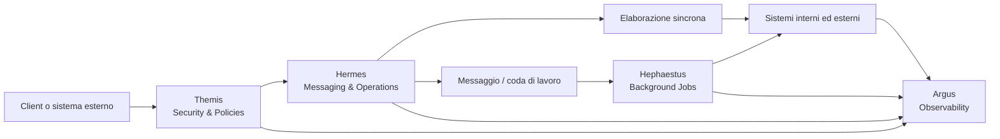
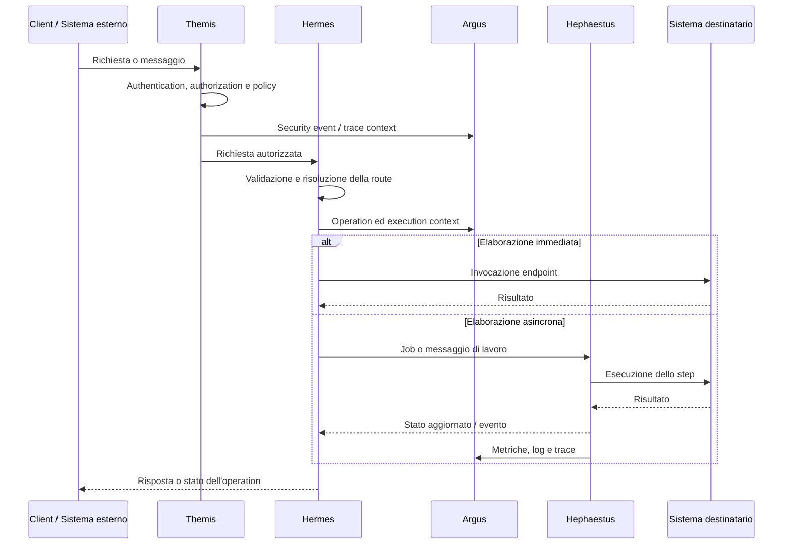

# Pantheon Operation Platform

> Piattaforma modulare per governare, instradare, eseguire e osservare operazioni tra sistemi interni, servizi esterni e processi distribuiti.

Pantheon è progettato come un gateway operativo estendibile: riceve richieste e messaggi, valida e protegge l'accesso, determina come eseguire un'operazione, coordina i processi sincroni e asincroni e rende osservabile ogni passaggio del ciclo di vita.

Il sistema è organizzato attorno a moduli con responsabilità precise. Ogni modulo prende il nome da una figura mitologica e rappresenta una capacità distinta della piattaforma:

| Modulo | Ruolo | Responsabilità principale |
|---|---|---|
| **Hermes** | Il messaggero | Ingresso, messaggistica, routing e gestione delle operazioni |
| **Hephaestus** | Il costruttore | Job background, elaborazioni asincrone e processi di esecuzione |
| **Argus** | Il vigilante | Observability, logging, metriche, tracing e controllo operativo |
| **Themis** | La legge | Authentication, authorization, policy, middleware e protezione trasversale |

> **Stato del repository:** in questa fase è presente l'implementazione iniziale di Hermes, organizzata in `Api`, `Application`, `Domain` e `Infrastructure`. Hephaestus, Argus e Themis rappresentano i moduli architetturali della piattaforma e vengono integrati progressivamente.

## Indice

- [Obiettivi](#obiettivi)
- [Architettura della piattaforma](#architettura-della-piattaforma)
- [I moduli di Pantheon](#i-moduli-di-pantheon)
- [Hermes: il messaggero](#hermes-il-messaggero)
- [Hephaestus: background processing](#hephaestus-background-processing)
- [Argus: observability](#argus-observability)
- [Themis: security e governance](#themis-security-e-governance)
- [Flusso end-to-end](#flusso-end-to-end)
- [Struttura del repository](#struttura-del-repository)
- [Principi architetturali](#principi-architetturali)
- [Stack](#stack)
- [Sviluppo locale](#sviluppo-locale)
- [Test](#test)
- [Roadmap](#roadmap)

---

## Obiettivi

Pantheon nasce per fornire un punto di coordinamento unico per operazioni distribuite e integrazioni eterogenee.

Gli obiettivi principali sono:

- esporre contratti HTTP e messaggistici coerenti;
- separare la definizione di un'operazione dalla sua esecuzione;
- instradare le operazioni verso endpoint e sistemi configurati;
- supportare esecuzioni composte da più step ordinati;
- spostare i processi lunghi o ripetibili su job background;
- mantenere correlazione e tracciabilità dall'ingresso alla conclusione;
- applicare autenticazione, autorizzazione e policy in modo uniforme;
- raccogliere log, metriche e trace senza duplicare codice nei moduli applicativi;
- mantenere il dominio indipendente da HTTP, broker, database e SDK esterni.

---

## Architettura della piattaforma



Pantheon non è pensato come un singolo blocco applicativo. È un insieme di moduli cooperanti con confini chiari:

1. **Themis** protegge la richiesta e applica le policy prima che raggiunga i casi d'uso.
2. **Hermes** riceve il messaggio o la richiesta, identifica l'operazione e determina il percorso configurato.
3. **Hephaestus** esegue i lavori differibili, lunghi o affidati a retry e scheduling.
4. **Argus** osserva il comportamento della piattaforma e collega gli eventi tramite correlation ID e operation ID.
5. I moduli condividono contratti e contesto, ma non trasferiscono la responsabilità delle proprie regole agli altri moduli.

---

## I moduli di Pantheon

### Hermes — il messaggero

Hermes è il modulo di ingresso e coordinamento delle operazioni. Rappresenta il confine tra Pantheon e i client, i sistemi esterni e i canali di messaggistica.

Le sue responsabilità comprendono:

- ricevere richieste e messaggi;
- validare i contratti in ingresso;
- identificare client, operation type ed endpoint;
- risolvere le route configurate;
- creare e gestire le operation;
- rappresentare execution, step e package;
- convertire i contratti esterni in command/query applicative;
- restituire risposte e errori uniformi.

Nel repository Hermes è suddiviso in:

```text
Hermes
├── Hermes.Api            # HTTP, controller, request/response e gestione errori
├── Hermes.Application    # use case, command/query handler e DTO
├── Hermes.Domain         # entità, value object, stati e repository astratti
└── Hermes.Infrastructure  # punto di integrazione con la persistenza e i servizi tecnici
```

Il dominio di Hermes distingue chiaramente:

- **Configuration:** `Client`, `OperationType`, `Endpoint`, `Route` e associazioni;
- **Runtime:** `Operation`, `Execution`, `ExecutionStep` e relativi tipi;
- **Payload:** `Package`, `Data`, `Header` e `Metadata`.

Una `Route` descrive un percorso configurato `Client → OperationType → Endpoint`; una `Operation` rappresenta invece una richiesta concreta ricevuta dalla piattaforma.

Per maggiori dettagli:

- [`Hermes.Api`](src/Hermes/Hermes.Api/Hermes.Api.ReadMe.md)
- [`Hermes.Application`](src/Hermes/Hermes.Application/Hermes.Application.ReadMe.md)
- [`Hermes.Domain`](src/Hermes/Hermes.Domain/Hermes.Domain.ReadMe.md)

### Hephaestus — background processing

Hephaestus è il sistema di esecuzione in background di Pantheon. Prende in carico i lavori che non devono essere completati durante la richiesta HTTP o che richiedono controllo, retry, scheduling e gestione indipendente del ciclo di vita.

Il modulo è destinato a gestire:

- job asincroni derivati da operation ed execution step;
- code e messaggi di lavoro;
- retry e backoff;
- timeout e cancellazione;
- scheduling e differimento dell'esecuzione;
- isolamento dei processi lunghi;
- aggiornamento dello stato di execution e step;
- gestione degli errori e dei dead-letter flow;
- coordinamento con gli endpoint esterni.

Hephaestus non deve diventare il proprietario delle regole di dominio di Hermes: esegue il lavoro assegnato e comunica l'esito attraverso contratti e stati espliciti.

### Argus — observability

Argus è il sistema di osservabilità della piattaforma. Il suo scopo è rendere visibili il comportamento, le prestazioni e gli errori di Pantheon senza introdurre logica di business nei moduli osservati.

Le capacità previste includono:

- logging strutturato;
- correlation ID, operation ID ed execution ID;
- metriche tecniche e applicative;
- distributed tracing;
- durata e risultato degli step;
- conteggio di retry, errori e timeout;
- health check e readiness/liveness;
- audit degli eventi rilevanti;
- integrazione con sistemi centralizzati di monitoraggio e alerting.

Argus deve permettere di seguire una singola operazione attraverso Themis, Hermes, Hephaestus e i sistemi destinatari.

### Themis — security e governance

Themis è il modulo trasversale di protezione e governo degli accessi. Centralizza i meccanismi comuni che non devono essere implementati singolarmente nei controller o nei worker.

Le sue responsabilità comprendono:

- authentication e verifica dell'identità;
- authorization e valutazione dei permessi;
- policy applicative e tecniche;
- middleware di sicurezza;
- gestione del contesto dell'utente o del servizio chiamante;
- protezione degli endpoint HTTP e dei messaggi;
- validazione di tenant, client, scope e claim quando applicabile;
- gestione coerente degli errori di accesso;
- sicurezza dei dati sensibili e minimizzazione delle informazioni esposte.

Themis deve operare come una protezione comune della pipeline, lasciando ai singoli moduli soltanto le verifiche specifiche del proprio caso d'uso.

---

## Flusso end-to-end



La correlazione deve essere mantenuta in ogni passaggio. Gli identificativi di riferimento principali sono:

- **Correlation ID:** collega i messaggi e le richieste appartenenti allo stesso flusso;
- **Operation ID:** identifica l'operazione di business;
- **Execution ID:** identifica una specifica elaborazione;
- **Step ID:** identifica una fase dell'elaborazione.

---

## Struttura del repository

```text
PantheonOperationPlatform/
├── Pantheon.slnx
├── src/
│   └── Hermes/
│       ├── Hermes.Api/             # ingresso HTTP e contratti REST
│       ├── Hermes.Application/     # orchestrazione dei casi d'uso
│       ├── Hermes.Domain/          # modello e regole di dominio
│       └── Hermes.Infrastructure/ # implementazioni tecniche e persistenza
├── tests/
│   ├── Hermes.Api.Tests/           # test del layer API
│   ├── Hermes.IntegrationTests/    # test di integrazione
│   └── Hermes.UnitTests/           # test unitari
├── .devcontainer/                  # ambiente di sviluppo .NET
└── .vscode/                        # task di sviluppo locali
```

La struttura prevista per l'estensione della piattaforma è:

```text
src/
├── Hermes/       # messaggistica, routing e operazioni
├── Hephaestus/   # worker e background processing
├── Argus/        # logging, metriche, tracing e audit
└── Themis/       # authentication, authorization, policy e middleware
```

Ogni modulo potrà mantenere i propri layer interni, senza perdere la separazione tra API, Application, Domain e Infrastructure quando applicabile.

---

## Principi architetturali

1. **Modularità per capacità** — ogni divinità rappresenta una responsabilità tecnica e funzionale distinta.
2. **Clean Architecture** — il dominio non dipende da framework, database, broker o sistemi esterni.
3. **Domain-first** — invarianti e transizioni appartengono alle entità e ai value object.
4. **Controller e worker sottili** — l'ingresso HTTP e l'esecuzione background coordinano, ma non duplicano la logica applicativa.
5. **Contratti espliciti** — request, response, command, query, eventi e messaggi sono modelli distinti.
6. **Configuration ≠ Runtime** — ciò che è configurato, come route ed endpoint, è distinto da ciò che viene eseguito.
7. **Sincrono quando serve, asincrono quando conviene** — le operazioni lunghe o affidate a retry passano a Hephaestus.
8. **Security by default** — Themis applica protezioni comuni prima dell'accesso ai casi d'uso.
9. **Observability by default** — Argus riceve il contesto di correlazione e gli eventi dei moduli.
10. **Errori tipizzati e uniformi** — gli errori devono essere identificabili tramite codice, tipo e contesto.
11. **Cancellazione e resilienza** — le operazioni asincrone propagano cancellation token, timeout e segnali di stop.
12. **Nessun accoppiamento inutile** — un modulo comunica con gli altri tramite astrazioni e contratti stabili.

---

## Stack

- **Linguaggio:** C#
- **Runtime:** .NET 10 (`net10.0`)
- **Web:** ASP.NET Core MVC
- **Validazione:** FluentValidation
- **API documentation:** OpenAPI e Swagger UI in Development
- **Architettura:** Clean Architecture con separazione Domain, Application, API e Infrastructure
- **Ambiente di sviluppo:** Dev Container basato su `mcr.microsoft.com/dotnet/sdk:10.0`

I dettagli dei broker, dei provider di persistenza, dei sistemi di observability e dei meccanismi di identity verranno introdotti nei rispettivi moduli senza contaminare il dominio.

---

## Sviluppo locale

È necessario avere installato .NET SDK 10 oppure utilizzare il Dev Container del repository.

```bash
git clone https://github.com/VincenzoMatonti/PantheonOperationPlatform.git
cd PantheonOperationPlatform

dotnet restore Pantheon.slnx
dotnet build Pantheon.slnx
```

Per avviare l'API Hermes:

```bash
dotnet run --project src/Hermes/Hermes.Api/Hermes.Api.csproj
```

In ambiente Development l'API utilizza gli URL configurati nei launch settings:

- `http://localhost:5080`
- `https://localhost:7138`
- OpenAPI e Swagger UI sono disponibili solo in Development.

Per usare il Dev Container, aprire il repository in VS Code e scegliere **Reopen in Container**. L'immagine utilizza il .NET SDK 10 e monta il workspace in `/workspace`.

---

## Test

La solution include tre progetti di test dedicati a Hermes:

```bash
dotnet test Pantheon.slnx
```

I test sono separati per responsabilità:

- `Hermes.UnitTests` per il comportamento isolato del dominio e dell'application layer;
- `Hermes.Api.Tests` per il layer HTTP;
- `Hermes.IntegrationTests` per verificare l'integrazione tra più componenti.

---

## Roadmap

L'evoluzione della piattaforma può procedere per incrementi:

1. completare le implementazioni di persistenza e integrazione di Hermes;
2. estendere Hermes a endpoint, route, execution e package oltre ai casi d'uso già esposti;
3. introdurre Hephaestus con job, code, retry, scheduling e gestione dei fallimenti;
4. introdurre Argus con logging strutturato, metriche, tracing e audit correlati;
5. introdurre Themis con identity, authentication, authorization, policy e middleware;
6. definire contratti condivisi tra moduli senza condividere dettagli interni;
7. aggiungere test end-to-end sull'intero flusso di un'operation;
8. aggiungere deployment, health check, configurazione per ambiente e telemetria operativa.

---

## In sintesi

```text
Pantheon    = piattaforma complessiva
Hermes      = messaggi, routing e operation
Hephaestus  = job e background processing
Argus       = observability e controllo operativo
Themis      = authentication, authorization, policy e middleware
```

Pantheon coordina il viaggio di un'operazione: Themis ne controlla l'accesso, Hermes la comprende e la instrada, Hephaestus la esegue quando il lavoro è asincrono e Argus rende ogni passaggio osservabile.
