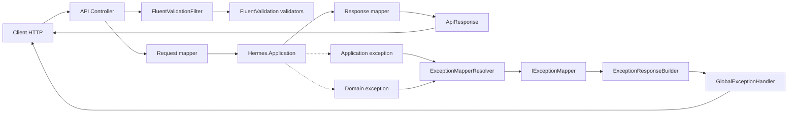
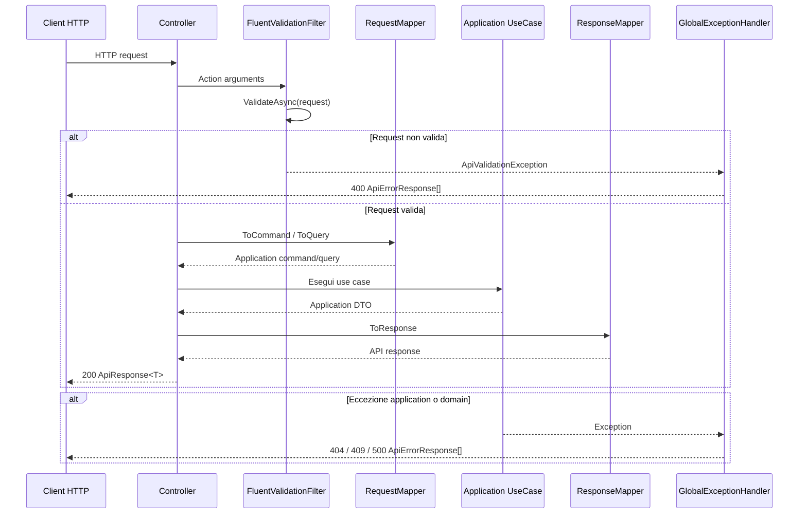

# Hermes.Api

> Il layer HTTP di Hermes: espone i casi d'uso applicativi tramite API REST, valida le richieste, converte request e response e traduce le eccezioni applicative e di dominio in risposte HTTP coerenti.

## Indice

- [Panoramica](#panoramica)
- [Mappa dell'API layer](#mappa-dellapi-layer)
- [Struttura del progetto](#struttura-del-progetto)
- [Controllers](#controllers)
- [Requests e Responses](#requests-e-responses)
- [Mappings](#mappings)
- [Validazione con FluentValidation](#validazione-con-fluentvalidation)
- [Gestione delle eccezioni](#gestione-delle-eccezioni)
- [Response comuni](#response-comuni)
- [Configurazione e dependency injection](#configurazione-e-dependency-injection)
- [Flusso HTTP](#flusso-http)
- [Dipendenze e responsabilità](#dipendenze-e-responsabilità)
- [Principi](#principi)

---

## Panoramica

`Hermes.Api` è il layer di ingresso HTTP dell'applicazione. Riceve le richieste REST, applica la validazione degli input, le converte nei command e nelle query di `Hermes.Application`, invoca il relativo use case e converte il risultato in una response API.

Il layer non implementa le regole di business e non accede direttamente al database. Le regole applicative restano in `Hermes.Application`, le invarianti e le transizioni restano in `Hermes.Domain`, mentre la persistenza è gestita da `Hermes.Infrastructure`.

| Area | Responsabilità |
|---|---|
| **Controllers** | Espongono gli endpoint HTTP e coordinano mapping e use case |
| **Requests** | Definiscono i contratti di input dell'API |
| **Responses** | Definiscono i contratti di output dell'API |
| **Mappings** | Traducono request in command/query e DTO applicativi in response |
| **Validations** | Validano le request con FluentValidation |
| **Exceptions** | Traducono errori applicativi, di dominio e tecnici in errori HTTP |
| **Filters** | Eseguono la validazione prima dell'action MVC |
| **Common** | Contiene wrapper e modelli comuni delle risposte API |

Il progetto usa `net10.0`, nullable reference types e ASP.NET Core MVC. La documentazione OpenAPI e Swagger UI sono disponibili in ambiente Development.

---

## Mappa dell'API layer



### Relazioni principali

| Relazione | Responsabilità |
|---|---|
| `Controller` — `RequestMapper` | Converte la request HTTP in command o query applicativa |
| `Controller` — `UseCaseHandler` | Invoca il caso d'uso corretto con il `CancellationToken` della richiesta |
| `UseCaseHandler` — `ResponseMapper` | Converte il DTO applicativo in response HTTP |
| `FluentValidationFilter` — `IValidator<T>` | Individua ed esegue il validator associato al tipo della request |
| `ExceptionMapperResolver` — `IExceptionMapper` | Seleziona il mapper capace di gestire l'eccezione ricevuta |
| `GlobalExceptionHandler` — `ExceptionResponseBuilder` | Costruisce la risposta HTTP uniforme per gli errori |

---

## Struttura del progetto

```text
Hermes.Api/
├── Clients/
│   ├── Controllers/
│   ├── Mappings/
│   │   ├── Commands/
│   │   ├── Exceptions/
│   │   └── Queries/
│   ├── Requests/
│   ├── Responses/
│   └── Validations/
├── Common/
│   ├── ApiResponse.cs
│   └── PropertyApiResponse.cs
├── Exceptions/
│   ├── Builders/
│   ├── Handlers/
│   ├── Mappings/
│   └── Models/
├── Filters/
│   └── FluentValidationFilter.cs
├── Program.cs
└── Hermes.Api.csproj
```

Le funzionalità sono organizzate per area applicativa. Attualmente l'API espone le aree `Clients` e `ClientOperation`; la stessa struttura può essere estesa con `Operations` e `OperationTypes` aggiungendo controller, request, response, mapper e validator dedicati.

---

## Controllers

I controller sono il punto di ingresso HTTP. Non contengono logica di dominio e non costruiscono direttamente le entità applicative: ricevono una request, usano il mapper appropriato, invocano lo use case e incapsulano il risultato in `ApiResponse<T>`.

### Client command

`ClientCommandApiController` espone gli endpoint sotto `api/client/command`:

| Metodo | Endpoint | Operazione |
|---|---|---|
| `POST` | `/create` | Crea un client |
| `PUT` | `/rename` | Rinomina un client |
| `PUT` | `/renameCode` | Modifica il codice del client |
| `PUT` | `/activate` | Attiva un client |
| `PUT` | `/deactivate` | Disattiva un client |
| `DELETE` | `/delete` | Cancella logicamente un client |
| `PUT` | `/restore` | Ripristina un client |

### Client query

`ClientQueryApiController` espone gli endpoint sotto `api/client/query`:

| Metodo | Endpoint | Operazione |
|---|---|---|
| `GET` | `/all` | Recupera tutti i client |
| `POST` | `/byId` | Recupera un client per id |
| `POST` | `/byCode` | Recupera un client per codice |
| `POST` | `/codeById` | Recupera il codice di un client |
| `GET` | `/allCodes` | Recupera tutti i codici |
| `GET` | `/active` | Recupera i client attivi |
| `GET` | `/nonActive` | Recupera i client non attivi |
| `GET` | `/deleted` | Recupera i client cancellati |

### ClientOperation command

`ClientOperationCommandApiController` espone gli endpoint sotto `api/clientOperation/command` per creare, abilitare, disabilitare, cancellare logicamente e ripristinare l'associazione tra client e operation type.

### ClientOperation query

`ClientOperationQueryApiController` espone gli endpoint sotto `api/clientOperation/query` per cercare un'associazione per id, per client e operation type, per client id, per operation type id e per stato.

Tutte le action asincrone ricevono e propagano il `CancellationToken` della richiesta HTTP verso il layer applicativo.

---

## Requests e Responses

### Requests

Le request rappresentano i contratti HTTP in ingresso e sono specifiche dell'API. Non vengono passate direttamente al dominio o all'application layer.

Esempi:

- `CreateClientRequest`;
- `RenameClientRequest`;
- `RenameClientCodeRequest`;
- `GetClientByIdRequest`;
- `GetClientByCodeRequest`;
- `CreateClientOperationRequest`;
- `EnableClientOperationRequest`;
- `GetClientOperationByIdRequest`.

### Responses

Le response rappresentano i contratti HTTP in uscita e non espongono direttamente entità o value object del dominio.

Esempi:

- `ClientResponse` e `ClientCodeResponse`;
- `CreateClientResponse`, `RenameClientResponse` e `RenameClientCodeResponse`;
- `ActivateClientResponse`, `DeactivateClientResponse` e `DeleteClientResponse`;
- `RestoreClientResponse`;
- `ClientOperationResponse` e le response delle relative operazioni.

Il risultato viene normalmente restituito con un wrapper `ApiResponse<T>` per mantenere una forma uniforme tra gli endpoint.

---

## Mappings

I mapper isolano il confine tra il modello HTTP e quello applicativo. Sono divisi in mapper per command, query ed eccezioni.

### Request mapper

I request mapper convertono le request API in command o query di `Hermes.Application`:

```text
CreateClientRequest
  → ClientCommandRequestMapper
  → CreateClientCommand
  → ClientUseCaseHandler
```

```text
GetClientByIdRequest
  → ClientQueryRequestMapper
  → GetClientByIdQuery
  → ClientUseCaseHandler
```

Sono presenti mapper distinti per `Client` e `ClientOperation`, così da mantenere separati i contratti delle diverse aree.

### Response mapper

I response mapper convertono i DTO restituiti dall'application layer nelle response HTTP dell'API:

```text
ClientDto
  → ClientCommandResponseMapper / ClientQueryResponseMapper
  → ClientResponse
  → ApiResponse<ClientResponse>
```

Le conversioni supportano sia il singolo risultato sia le liste e impediscono che i DTO applicativi diventino parte del contratto HTTP pubblico.

### Exception mapper

Gli exception mapper implementano `IExceptionMapper` e trasformano le eccezioni in `ExceptionMappingResult`, contenente status code e lista di `ApiErrorResponse`.

I mapper presenti includono:

- `ValidationExceptionMapper` per gli errori di validazione;
- `ClientExceptionMapper` per eccezioni applicative e di dominio dei client;
- `ClientOperationExceptionMapper` per eccezioni applicative e di dominio delle associazioni;
- `InternalExceptionMapper` per errori tecnici o di configurazione dell'API.

---

## Validazione con FluentValidation

La validazione degli input HTTP è realizzata con FluentValidation e viene eseguita da `FluentValidationFilter` prima dell'esecuzione dell'action.

Il filtro:

1. esamina gli argomenti dell'action;
2. individua il validator `IValidator<T>` registrato per il tipo concreto della request;
3. esegue `ValidateAsync` usando `HttpContext.RequestAborted`;
4. raccoglie tutti gli errori;
5. legge da `CustomState` il codice enum dell'errore;
6. solleva `ApiValidationException` se esistono errori.

Le regole usano `WithState(...)` per associare un codice stabile all'errore, oltre al messaggio destinato al chiamante.

Esempi di regole presenti:

- id obbligatori con `NotEmpty()`;
- codice client obbligatorio e con lunghezza massima di 100 caratteri;
- nome client obbligatorio e con lunghezza massima di 200 caratteri;
- client id e operation type id obbligatori per le associazioni.

La registrazione avviene tramite:

```csharp
builder.Services.AddValidatorsFromAssemblyContaining<CreateClientRequestValidator>();
```

Se una regola non definisce un codice enum valido, il filtro solleva `ApiValidationConfigurationException`, che viene trattata come errore interno di configurazione.

---

## Gestione delle eccezioni

La gestione globale è registrata con `AddExceptionHandler<GlobalExceptionHandler>()` e attivata tramite `app.UseExceptionHandler()`.

### Pipeline delle eccezioni

```text
Exception
  → ExceptionMapperResolver
  → IExceptionMapper
  → ExceptionMappingResult
  → ExceptionResponseBuilder
  → GlobalExceptionHandler
  → HTTP status + ApiErrorResponse[]
```

`ExceptionMapperResolver` cerca il primo mapper per cui `CanHandle(exception)` restituisce `true`. Se nessun mapper è disponibile, solleva `ApiExceptionMapperNotFoundException`.

### Errori di validazione

`ValidationExceptionMapper` converte `ApiValidationException` in:

- HTTP `400 Bad Request`;
- `ApiErrorType.Validation`;
- un errore per ogni proprietà non valida;
- codice enum e messaggio definiti dal validator.

### Errori applicativi e di dominio

I mapper di area distinguono gli errori applicativi dagli errori di dominio:

| Tipo di errore | Risposta tipica |
|---|---|
| Risorsa non trovata | `404 Not Found` |
| Risorsa già esistente o conflitto applicativo | `409 Conflict` |
| Regola di dominio non rispettata | `409 Conflict` |
| Errore interno o configurazione errata | `500 Internal Server Error` |

Gli errori espongono tipo, entità, codice e messaggio tramite `ApiErrorResponse`.

### Errori interni

`InternalExceptionMapper` tratta gli errori di configurazione e infrastrutturali dell'API, tra cui:

- `ApiInternalException`;
- `ApiValidationConfigurationException`;
- `ApiExceptionMapperNotFoundException`;
- `ApiExceptionMapperConfigurationException`.

Il messaggio restituito al client è generico per non esporre dettagli interni dell'applicazione.

---

## Response comuni

`ApiResponse<T>` fornisce il wrapper comune delle risposte di successo, mentre `PropertyApiResponse` supporta i dettagli associati a una specifica proprietà.

Gli errori sono rappresentati da `ApiErrorResponse` e classificati tramite:

- `ApiErrorType`, ad esempio `Validation`, `NotFound`, `Conflict` e `Internal`;
- `ApiErrorEntity`, ad esempio `Client`, `ClientOperation` e `Unknown`.

Questa struttura consente ai client di interpretare gli errori tramite codice e tipo, senza dipendere esclusivamente dal testo del messaggio.

---

## Configurazione e dependency injection

`Program.cs` configura:

- controller MVC;
- `FluentValidationFilter` come action filter globale;
- validator FluentValidation tramite assembly scanning;
- `GlobalExceptionHandler`;
- exception mapper e `ExceptionMapperResolver`;
- `ExceptionResponseBuilder`;
- request mapper e response mapper;
- handler applicativi per `Client` e `ClientOperation`;
- OpenAPI e Swagger UI in ambiente Development.

La registrazione dei servizi mantiene i controller sottili e consente di sostituire o estendere mapper, validator e gestori senza modificare il flusso applicativo.

---

## Flusso HTTP



Il layer API non esegue il commit della transazione e non gestisce direttamente la persistenza. Il suo compito è adattare il protocollo HTTP ai contratti applicativi.

---

## Dipendenze e responsabilità

### Dipendenze consentite

```text
Hermes.Api
  → Hermes.Application
  → Hermes.Infrastructure
```

L'API può usare:

- command, query, DTO e use case dell'application layer;
- i servizi infrastrutturali registrati nel container;
- ASP.NET Core, FluentValidation e OpenAPI;
- i modelli HTTP propri dell'API.

### Responsabilità dell'API

- definire endpoint e verbi HTTP;
- validare il formato e i dati obbligatori delle request;
- convertire contratti HTTP e applicativi;
- propagare la cancellazione della richiesta;
- uniformare le risposte di successo e di errore;
- nascondere i dettagli delle eccezioni interne al client.

### Responsabilità non appartenenti all'API

L'API non deve:

- implementare invarianti o transizioni di dominio;
- duplicare la logica dei use case;
- accedere direttamente a repository o DbContext;
- costruire query SQL;
- contenere mapping Entity Framework;
- restituire direttamente entità o value object del dominio;
- gestire manualmente ogni eccezione dentro i controller.

---

## Principi

1. **Controller sottili** — il controller coordina mapping e use case, senza contenere logica di business.
2. **Contratti HTTP separati** — request e response non coincidono con command, query o DTO applicativi.
3. **Validazione al bordo** — gli input vengono validati prima di raggiungere l'application layer.
4. **Codici di errore stabili** — gli errori usano enum e codici leggibili dai client.
5. **Eccezioni centralizzate** — la risposta agli errori passa da resolver, mapper, builder e handler globali.
6. **Mapping esplicito** — request, response ed eccezioni vengono convertite da componenti dedicati.
7. **Asincronia e cancellazione** — le action propagano il `CancellationToken` fino al caso d'uso.
8. **Risposte uniformi** — successi ed errori seguono modelli API comuni.
9. **Nessuna logica di dominio nell'API** — invarianti e transizioni appartengono a Domain e Application.
10. **Estendibilità per area** — ogni nuova area può aggiungere controller, mapper, validator ed exception mapper senza alterare quelle esistenti.

## In sintesi

```text
Controller             = ingresso HTTP e coordinamento
Request                = contratto HTTP in ingresso
Response               = contratto HTTP in uscita
RequestMapper          = HTTP request → command/query
ResponseMapper         = application DTO → HTTP response
FluentValidation       = validazione degli input al bordo
IExceptionMapper       = exception → status code e ApiErrorResponse
GlobalExceptionHandler = gestione uniforme degli errori
ApiResponse            = wrapper comune delle risposte
```
