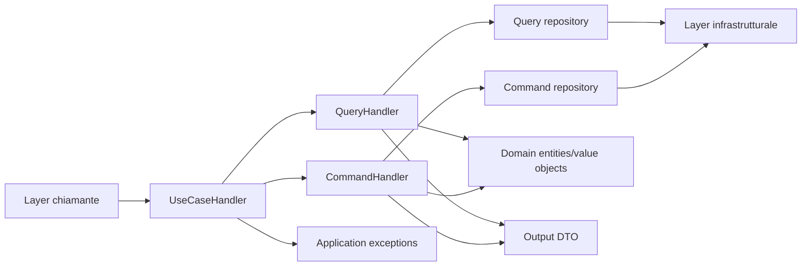
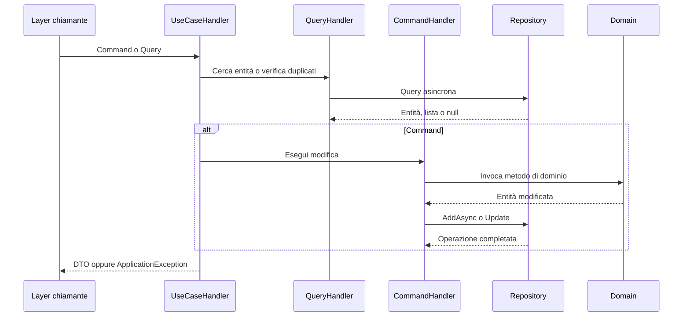

# Hermes.Application

> Il livello applicativo di Hermes: orchestra i casi d'uso, coordina query e comandi, applica le verifiche applicative e traduce il modello di dominio in DTO senza conoscere i dettagli dell'infrastruttura.

## Indice

- [Panoramica](#panoramica)
- [Mappa dell'application layer](#mappa-dellapplication-layer)
- [Struttura del progetto](#struttura-del-progetto)
- [Casi d'uso](#casi-duso)
- [Commands](#commands)
- [Queries](#queries)
- [DTO](#dto)
- [Eccezioni](#eccezioni)
- [Flusso applicativo](#flusso-applicativo)
- [Dipendenze e responsabilità](#dipendenze-e-responsabilità)
- [Principi](#principi)

---

## Panoramica

Hermes.Application espone le operazioni che l'applicazione può eseguire sul dominio. Riceve un comando o una query, recupera le entità necessarie tramite i repository del dominio, invoca i metodi di dominio appropriati e restituisce un DTO destinato al layer chiamante.

Il layer non contiene dettagli HTTP, database, Entity Framework, messaggistica o SDK esterni. Questi aspetti appartengono ai layer di ingresso e infrastrutturale.

| Area | Responsabilità |
|---|---|
| **Use cases** | Definisce il flusso completo di un'operazione applicativa |
| **Commands** | Modifica il dominio attraverso i repository e i metodi delle entità |
| **Queries** | Recupera dati dal dominio e converte le entità in DTO |
| **DTOs** | Definisce i contratti di input e output dell'application layer |
| **Exceptions** | Rende espliciti gli errori applicativi e le risorse non trovate |
| **Common** | Contiene le astrazioni condivise, come `ApplicationException<TCode>` |

Il progetto applicativo dipende da `Hermes.Domain` e utilizza il framework target `net10.0` con nullable reference types abilitati.

---

## Mappa dell'application layer



### Relazioni principali

| Relazione | Responsabilità |
|---|---|
| `UseCaseHandler` — `QueryHandler` | Recupera dati e verifica l'esistenza delle risorse |
| `UseCaseHandler` — `CommandHandler` | Esegue il cambiamento richiesto sul dominio |
| `QueryHandler` — query repository | Legge entità e value object in modo asincrono |
| `CommandHandler` — command repository | Aggiunge o marca come modificata un'entità |
| `Handler` — DTO | Traduce entità e value object in contratti applicativi |
| `UseCaseHandler` — eccezioni | Espone errori applicativi tipizzati, come risorsa non trovata o duplicata |

---

## Struttura del progetto

```text
Hermes.Application/
├── Clients/
│   ├── Commands/
│   ├── DTOs/
│   ├── Exceptions/
│   ├── Queries/
│   └── UseCases/
├── Common/
│   └── ApplicationException.cs
├── Operations/
│   ├── Commands/
│   ├── DTOs/
│   ├── Exceptions/
│   ├── Queries/
│   └── UseCases/
└── Hermes.Application.csproj
```

Le funzionalità sono organizzate per area di dominio. Ogni area mantiene separati i contratti, la lettura, la scrittura, i casi d'uso e gli errori applicativi.

### Aree applicative

| Area | Handler principale | Responsabilità |
|---|---|---|
| `Clients` | `ClientUseCaseHandler` | Gestione dei client e dei relativi codici |
| `Clients` | `ClientOperationUseCaseHandler` | Gestione delle associazioni tra client e operation type |
| `Operations` | `OperationUseCaseHandler` | Creazione, avanzamento di stato, cancellazione e consultazione delle operation |
| `Operations` | `OperationTypeUseCaseHandler` | Gestione del catalogo degli operation type |
| `Common` | `ApplicationException<TCode>` | Base comune per le eccezioni applicative tipizzate |

---

## Casi d'uso

I casi d'uso sono il punto di ingresso applicativo. Coordinano uno o più handler e non espongono direttamente le entità di dominio al chiamante.

Un caso d'uso command segue generalmente questo flusso:

```text
Command
  → validazione applicativa e ricerca della risorsa
  → CommandHandler
  → metodo dell'entità di dominio
  → repository Update/AddAsync
  → conversione in DTO
  → risultato
```

Un caso d'uso query segue invece questo flusso:

```text
Query
  → QueryHandler
  → query repository
  → controllo del risultato
  → conversione in DTO
  → risultato oppure eccezione applicativa
```

### Client

`ClientUseCaseHandler` gestisce i principali casi d'uso del client:

| Categoria | Operazioni |
|---|---|
| Creazione | `CreateClientAsync` |
| Modifica | `RenameClientAsync`, `RenameCodeClientAsync` |
| Stato | `ActivateClientAsync`, `DeactivateClientAsync` |
| Cancellazione | `DeletedClientAsync`, `RestoreClientAsync` |
| Lettura singola | Per id, per codice e per codice del client |
| Lettura multipla | Tutti, attivi, non attivi, cancellati e tutti i codici |

Durante la creazione e la modifica del codice viene verificata l'unicità del codice applicativo prima di invocare il dominio.

### ClientOperation

`ClientOperationUseCaseHandler` orchestra l'associazione tra un client e un operation type, compresa la sua abilitazione, disabilitazione, cancellazione logica, ripristino e consultazione.

### Operation

`OperationUseCaseHandler` gestisce il ciclo applicativo dell'operation:

| Categoria | Operazioni |
|---|---|
| Creazione | `CreateOperationAsync` |
| Transizioni | `SendOperationAsync`, `ValidateOperationAsync`, `AcceptOperationAsync`, `RejectOperationAsync` |
| Cancellazione | `DeleteOperationAsync`, `RestoreOperationAsync` |
| Lettura singola | Per id, external id e correlation id |
| Lettura multipla | Tutte, cancellate, per stato e per execution id |

Prima della creazione vengono controllati sia `CorrelationId` sia `ExternalId`, così da impedire la duplicazione di una operation già registrata.

### OperationType

`OperationTypeUseCaseHandler` gestisce il catalogo degli operation type, incluse creazione, rinomina, attivazione, disattivazione, cancellazione logica, ripristino e relative query.

---

## Commands

I command rappresentano una richiesta di modifica. I relativi handler:

1. trasformano gli input primitivi in value object quando necessario;
2. invocano i metodi pubblici delle entità di dominio;
3. usano `AddAsync(...)` per nuove entità;
4. usano `Update(...)` per entità già esistenti;
5. restituiscono l'entità modificata al caso d'uso per la conversione in DTO.

I command handler non implementano direttamente le regole di stato: delegano tali regole al dominio. Ad esempio, `SendOperationAsync` invoca `operation.Send()`, mentre la validità della transizione resta responsabilità di `Operation`.

Le operazioni di persistenza sono asincrone quando viene aggiunta una nuova entità e ricevono un `CancellationToken`. Il commit della transazione non è responsabilità dell'application layer.

---

## Queries

I query handler sono responsabili della lettura attraverso le interfacce repository definite dal dominio.

Le query disponibili seguono convenzioni coerenti:

- restituiscono una singola entità o `null` quando la risorsa non è presente;
- restituiscono una lista per le ricerche multiple;
- accettano un `CancellationToken`;
- costruiscono i value object a partire dai valori ricevuti dalla query;
- non modificano lo stato del dominio.

Le query handler contengono anche le conversioni da entità o value object a DTO di lettura, ad esempio `Client` → `ClientDto` e `Operation` → `OperationDto`.

Il `UseCaseHandler` interpreta il risultato della query: quando una risorsa singola non esiste, solleva l'eccezione applicativa specifica; per le liste vuote restituisce una lista vuota.

---

## DTO

I DTO costituiscono il contratto tra l'application layer e il layer chiamante. Non espongono i value object del dominio come `ClientCode`, `CorrelationId` o `ExternalOperationId`, ma ne espongono il valore rappresentabile dal contratto applicativo.

### DTO di input

I command e le query descrivono i dati richiesti dal caso d'uso, per esempio:

- `CreateClientCommand`;
- `RenameClientCommand`;
- `GetClientByIdQuery`;
- `CreateOperationCommand`;
- `SendOperationCommand`;
- `GetOperationByCorrelationIdQuery`.

### DTO di output

I DTO di output sono specializzati per il risultato dell'operazione. Tra gli esempi presenti:

- `ClientDto`, `ClientCodeDto`;
- `CreateClientDto`, `RenameClientDto`, `ActivateClientDto`, `DeactivateClientDto`;
- `DeleteClientDto`, `RestoreClientDto`;
- `OperationDto`;
- `CreateOperationDto`, `SendOperationDto`, `ValidateOperationDto`;
- `AcceptOperationDto`, `RejectOperationDto`, `DeleteOperationDto`, `RestoreOperationDto`.

Le conversioni sono metodi statici degli handler e supportano sia la singola entità sia le liste.

---

## Eccezioni

### Base comune

`ApplicationException<TCode>` estende `Exception` e aggiunge un `Code` tipizzato come enum. Le eccezioni applicative possono quindi essere identificate dal chiamante senza analizzare il testo del messaggio.

```text
ApplicationException<TCode>
├── Client exceptions
├── ClientOperation exceptions
├── Operation exceptions
└── OperationType exceptions
```

### Responsabilità delle eccezioni

| Situazione | Responsabile |
|---|---|
| Input non valido per un value object | Dominio |
| Transizione di stato non consentita | Dominio |
| Entità richiesta non trovata | Application |
| Entità duplicata secondo una chiave applicativa | Application |
| Errore tecnico di persistenza o integrazione | Infrastruttura |

Esempi di errori applicativi sono `ClientNotFoundException`, `ClientAlreadyExistsException`, `OperationNotFoundException`, `OperationAlreadyExistsByCorrelationIdException` e `OperationAlreadyExistsByExternalIdException`.

---

## Flusso applicativo



L'application layer coordina il flusso, ma non sostituisce il dominio: la validazione delle invarianti e delle transizioni rimane nelle entità e nei value object di `Hermes.Domain`.

---

## Dipendenze e responsabilità

### Dipendenze consentite

```text
Hermes.Application → Hermes.Domain
```

L'application layer può usare:

- entità, value object, enum ed eccezioni del dominio;
- repository astratti definiti dal dominio;
- `CancellationToken` e astrazioni .NET comuni.

### Dipendenze non presenti

L'application layer non deve conoscere:

- Entity Framework o il provider del database;
- SQL e dettagli di persistenza;
- HTTP, REST o SOAP;
- Kafka, RabbitMQ o altri broker;
- controller, endpoint o framework di presentazione;
- SDK specifici dei sistemi esterni.

---

## Principi

1. **Use case come punto di orchestrazione** — il caso d'uso coordina lettura, modifica e conversione del risultato.
2. **Dominio come proprietario delle invarianti** — l'application layer non replica le regole di stato delle entità.
3. **Commands e Queries separati** — le modifiche e le letture seguono percorsi distinti.
4. **DTO al confine** — i contratti applicativi non espongono direttamente i dettagli interni del dominio.
5. **Repository astratti** — l'application layer usa interfacce e non implementazioni infrastrutturali.
6. **Errori applicativi espliciti** — risorse mancanti e duplicati sono rappresentati da eccezioni tipizzate.
7. **Asincronia e cancellazione** — le operazioni di accesso ai repository supportano `CancellationToken`.
8. **Nessun commit implicito** — il salvataggio della transazione resta responsabilità del layer infrastrutturale o del boundary applicativo superiore.
9. **Tecnologia indipendente** — il layer coordina il dominio senza conoscere i sistemi esterni.

## In sintesi

```text
Command         = richiesta di modifica
Query           = richiesta di lettura
DTO             = contratto applicativo in ingresso o uscita
CommandHandler  = applica una modifica usando il dominio
QueryHandler    = legge dal dominio e converte i risultati
UseCaseHandler  = orchestra il caso d'uso completo
Repository      = astrazione di accesso ai dati definita dal dominio
ApplicationException = errore applicativo identificabile tramite codice
```
