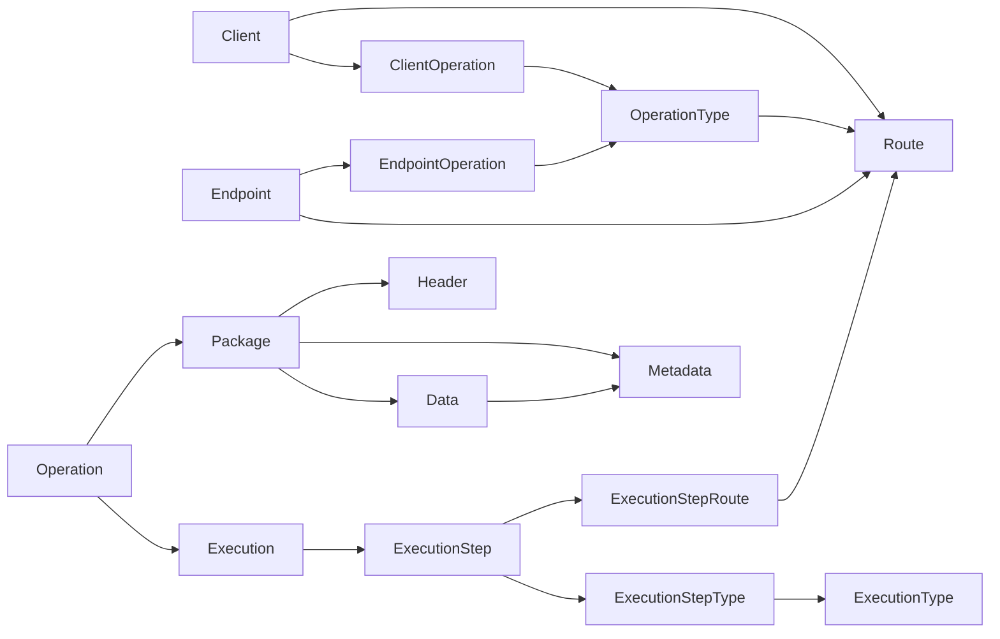
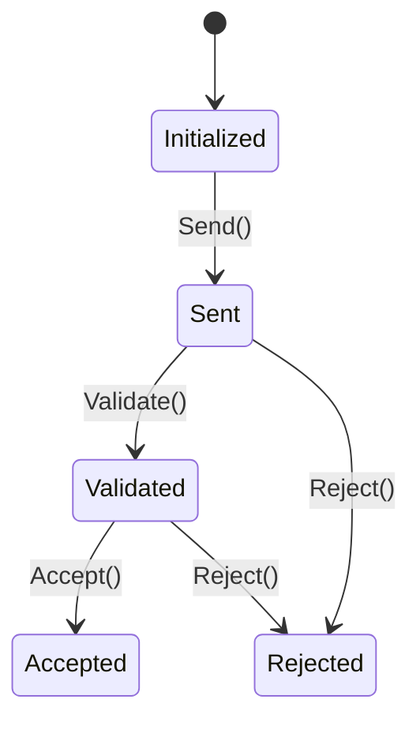
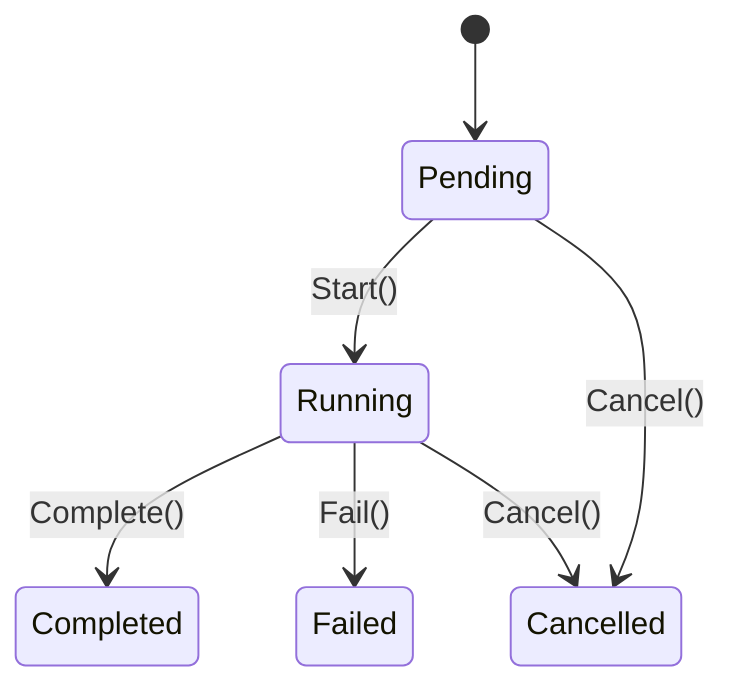
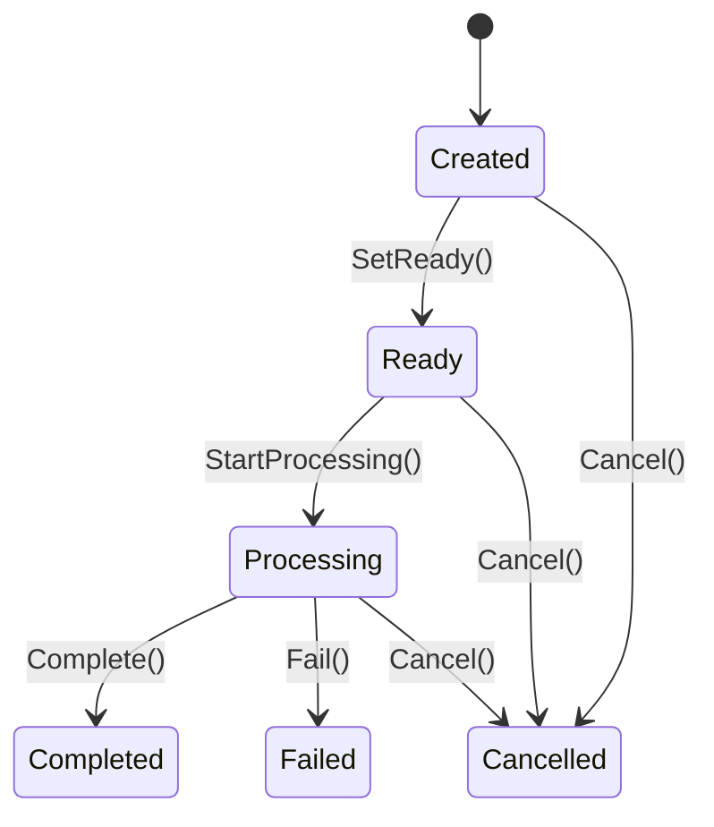

# Hermes.Domain

> The heart of Hermes: it defines what the system represents and which rules it must respect, without knowing how external systems are reached.

## Table of contents

- [Overview](#overview)
- [Domain map](#domain-map)
- [Entities](#entities)
- [Value objects and enumerations](#value-objects-and-enumerations)
- [Lifecycle](#lifecycle)
- [Repository](#repository)
- [Exceptions](#exceptions)
- [Principles](#principles)

---

## Overview

Hermes manages operations coming from different clients, validates them, and routes them to configured endpoints. A request can be composed of multiple steps, and each step can use several routes. A step can also carry packages with structured metadata.

| Area | Responsibility |
|---|---|
| **Configuration** | Defines available clients, operations, endpoints, and routes |
| **Runtime** | Represents operations, executions, and related steps |
| **Payload** | Organizes packages, data, headers, and metadata |
| **Domain rules** | Protects state transitions and required data |

---

## Domain map



### Main relationships

| Relationship | Cardinality | Relationship entity |
|---|:---:|---|
| `Client` — `OperationType` | N:N | `ClientOperation` |
| `Endpoint` — `OperationType` | N:N | `EndpointOperation` |
| `Operation` — `Execution` | 1:1 | — |
| `Execution` — `ExecutionStep` | 1:N | — |
| `ExecutionStep` — `Route` | N:N | `ExecutionStepRoute` |
| `ExecutionStep` — `ExecutionType` | N:N | `ExecutionStepType` |
| `Operation` — `Package` | 1:N | — |
| `Package` — `Data` | 1:N | — |
| `Package` — `Header` | 1:N | — |
| `Package` / `Data` — `Metadata` | 1:N | — |

---

## Entities

All entities use a `Guid` as identifier and manage `CreatedAt` and `UpdatedAt` in UTC where applicable. Creation occurs through static `Create(...)` methods, so invariants are enforced at the moment of creation.

### Configuration

| Entity | Purpose | Main properties | Behavior |
|---|---|---|---|
| `Client` | System or subject using Hermes | `Code`, `Name`, `IsActive`, `IsDeleted` | Activation, deactivation, rename, soft delete, and restore |
| `ClientOperation` | Enables an `OperationType` for a client | `ClientId`, `OperationTypeId`, `IsEnabled`, `IsDeleted` | Enable, disable, soft delete, and restore |
| `OperationType` | Catalog of managed operations | `Code`, `Name`, `IsActive`, `IsDeleted` | Activation, deactivation, rename, soft delete, and restore |
| `Endpoint` | Logical destination reachable by Hermes | `Code`, `Type`, `IsActive` | Activation and deactivation |
| `EndpointOperation` | Enables an `OperationType` for an endpoint | `EndpointId`, `OperationTypeId`, `IsEnabled` | Enable and disable |
| `Route` | Configured path `Client → OperationType → Endpoint` | `ClientId`, `OperationTypeId`, `EndpointId`, `IsActive` | Activation and deactivation |
| `ExecutionType` | Category for processing a step | `Code`, `Name`, `IsActive` | Activation, deactivation, and rename |

> `OperationType` and `ExecutionType` are configurable entities, not enums, because their catalog can evolve over time.

### Runtime

| Entity | Purpose | Main properties | Behavior |
|---|---|---|---|
| `Operation` | Concrete request received by Hermes | `ExecutionId`, `CorrelationId`, `ExternalId`, `Status`, `IsDeleted` | `Send`, `Validate`, `Accept`, `Reject`, soft delete, and restore |
| `Execution` | Full processing of an operation | `Status`, `StartedAt`, `CompletedAt` | Start, completion, failure, and cancellation |
| `ExecutionStep` | One ordered phase of an execution | `ExecutionId`, `Sequence`, `Status`, start/end dates | Start, completion, failure, skip, and cancellation |
| `ExecutionStepRoute` | Associates a step with a route | `ExecutionStepId`, `RouteId`, `IsEnabled` | Enable and disable |
| `ExecutionStepType` | Associates a step with a processing type | `ExecutionStepId`, `ExecutionTypeId`, `IsEnabled` | Enable and disable |

### Package and content

A `Package` contains the data transported during an `Operation`. Headers and metadata may describe the package; metadata may also belong to a specific `Data` item.

| Entity | Purpose | Main properties | Behavior |
|---|---|---|---|
| `Package` | Versioned container associated with an operation | `OperationId`, `Type`, `Status`, `ContentType`, `Version`, `Sequence` | Prepare, start, complete, fail, cancel, and recover |
| `Data` | Ordered binary content of the package | `PackageId`, `Type`, `ContentType`, `Content`, `Sequence` | Change type, content type, and replace content |
| `Header` | Key/value pair of the package | `PackageId`, `Key`, `Value` | Modify key and value |
| `Metadata` | Descriptive information for the package or data | `PackageId`, `DataId?`, `Key`, `Value` | Identify owner and modify key/value |

`Metadata` can be created in two ways:

```text
CreateForPackage(packageId, key, value)  → package metadata
CreateForData(packageId, dataId, key, value) → metadata for a specific data item
```

---

## Value objects and enumerations

Value objects encapsulate domain-relevant values and are created via `Create(...)` (or `From(...)` for `CorrelationId`). The current implementations validate that the value is not empty and enforce domain constraints.

### Value objects

| Area | Value object | Value |
|---|---|---|
| Client | `ClientCode` | Client code |
| Endpoint | `EndpointCode` | Endpoint code |
| Endpoint | `EndpointType` | Logical endpoint type (`Code`) |
| Operations | `OperationTypeCode` | Operation code |
| Operations | `CorrelationId` | Correlation `Guid`; generated or reconstructed with `From(Guid)` |
| Operations | `ExternalOperationId` | Operation identifier in the external system |
| Executions | `ExecutionTypeCode` | Processing type code |
| Packages | `PackageType` | Package type |
| Packages | `PackageVersion` | Package version |
| Packages | `DataType` | Data content type |
| Packages | `ContentType` | Format/content type of the content |
| Packages | `HeaderKey` / `HeaderValue` | Header key and value |
| Packages | `MetadataKey` / `MetadataValue` | Metadata key and value |

### State enumerations

| Enum | Values |
|---|---|
| `OperationStatus` | `Initialized`, `Sent`, `Validated`, `Accepted`, `Rejected` |
| `ExecutionStatus` | `Pending`, `Running`, `Completed`, `Failed`, `Cancelled` |
| `ExecutionStepStatus` | `Pending`, `Running`, `Completed`, `Failed`, `Skipped`, `Cancelled` |
| `PackageStatus` | `Created`, `Ready`, `Processing`, `Completed`, `Failed`, `Cancelled` |

---

## Lifecycle

### Operation



### Execution and ExecutionStep



An `ExecutionStep` may also transition from `Pending` to `Skipped`.

### Package



Unexpected transitions from the current state raise an `InvalidOperationException`.

---

## Repository

Repositories are **domain abstractions**: they expose read and write operations without binding Hermes to Entity Framework, SQL, or other infrastructure technologies.

| Area | Repository |
|---|---|
| Clients | `IClientCommandRepository`, `IClientQueryRepository` |
| Client operations | `IClientOperationCommandRepository`, `IClientOperationQueryRepository` |
| Endpoints | `IEndpointRepository`, `IEndpointOperationRepository` |
| Routes | `IRouteRepository` |
| Operations | `IOperationCommandRepository`, `IOperationQueryRepository` |
| Operation types | `IOperationTypeCommandRepository`, `IOperationTypeQueryRepository` |
| Executions | `IExecutionRepository`, `IExecutionStepRepository`, `IExecutionStepRouteRepository`, `IExecutionStepTypeRepository`, `IExecutionTypeRepository` |
| Packages | `IPackageRepository`, `IDataRepository`, `IHeaderRepository`, `IMetadataRepository` |

### Conventions

- Queries are asynchronous and accept a `CancellationToken`.
- `Get...` methods return `null` when a single resource is not found and a list for multi-resource searches.
- `AddAsync(...)` persists a new entity.
- `Update(...)` signals that an existing entity has changed.
- Transaction saving remains the responsibility of the application or infrastructure layer.

---

## Exceptions

### Common base

`DomainException<TCode>` extends `Exception` and adds a `Code` typed as an enum. Specific domain exceptions derive from this class to make errors identifiable and mappable.

### Existing typed exceptions

| Family | Main codes |
|---|---|
| `ClientException` | `CodeRequired`, `NameRequired`, `AlreadyActive`, `AlreadyInactive`, `AlreadyDeleted`, `NotDeleted` |
| `ClientOperationException` | `ClientIdRequired`, `OperationTypeIdRequired`, `AlreadyEnabled`, `AlreadyDisabled`, `AlreadyDeleted`, `NotDeleted` |
| `OperationException` | `ExecutionIdRequired`, `CorrelationIdRequired`, `ExternalIdRequired`, invalid states for `Send`, `Validate`, `Accept`, `Reject`, `AlreadyDeleted`, `NotDeleted` |
| `OperationTypeException` | `CodeRequired`, `NameRequired`, `AlreadyActive`, `AlreadyInactive`, `AlreadyDeleted`, `NotDeleted` |

The `Endpoint`, `Route`, `Execution`, `ExecutionStep`, and `Package` entities instead mainly use `ArgumentException`, `ArgumentNullException`, `ArgumentOutOfRangeException`, and `InvalidOperationException`.

---

## Principles

1. **Configuration ≠ Runtime** — a `Route` describes a configured path; an `Operation` is a concrete request.
2. **Protected states** — entities change state only through domain methods, not through public setters.
3. **Explicit N:N relationships** — `ClientOperation`, `EndpointOperation`, `ExecutionStepRoute`, and `ExecutionStepType` are dedicated, extensible entities.
4. **Soft delete where appropriate** — `Client`, `ClientOperation`, `OperationType`, and `Operation` support logical deletion and restoration.
5. **Technology independence** — the domain knows `Endpoint`, not HTTP, REST, SOAP, Kafka, RabbitMQ, databases, or SDKs.
6. **Package separate from execution** — `Package`, `Data`, `Header`, and `Metadata` model the transported content without introducing integration details.

## Summary

```text
Client          = who uses Hermes
OperationType   = which operation is available
Endpoint        = which destination can be reached
Route           = Client → OperationType → Endpoint
Operation       = concrete request
Execution       = overall processing
ExecutionStep   = one processing phase
ExecutionType   = step category
Package         = operation data container
Data            = package content
Header          = technical key/value information
Metadata        = descriptive information for the package or data
```
