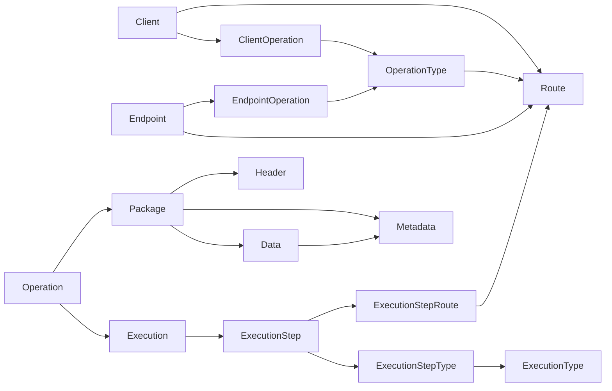
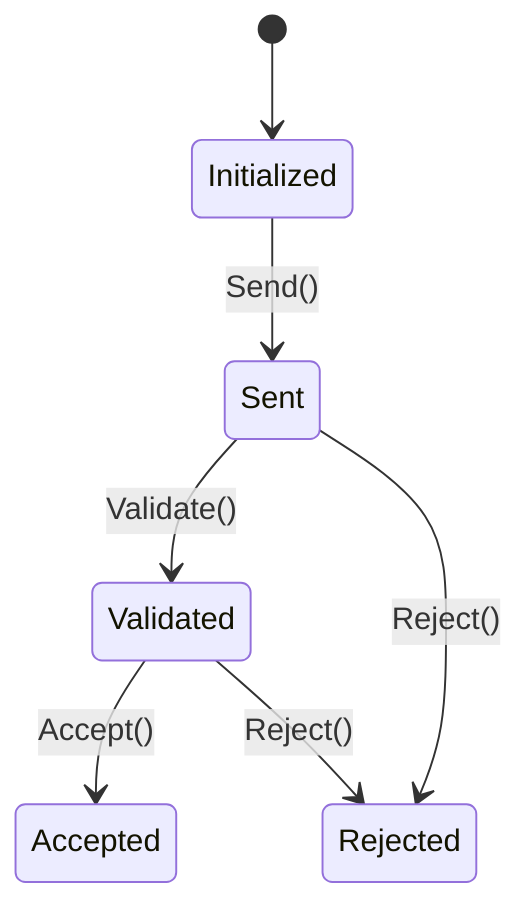
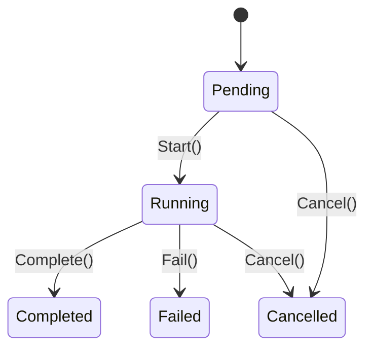
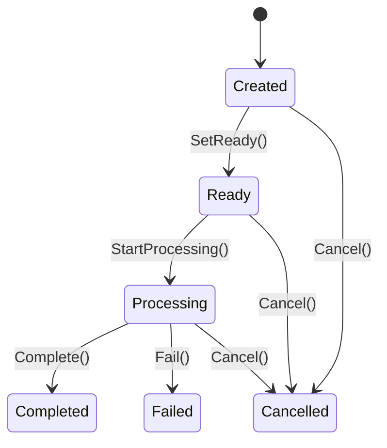

# Hermes.Domain

> Il cuore del dominio di Hermes: definisce **cosa** il sistema rappresenta e quali regole deve rispettare, senza conoscere **come** raggiungere i sistemi esterni.

## Indice

- [Panoramica](#panoramica)
- [Mappa del dominio](#mappa-del-dominio)
- [Entità](#entità)
- [Value object ed enumerazioni](#value-object-ed-enumerazioni)
- [Ciclo di vita](#ciclo-di-vita)
- [Repository](#repository)
- [Eccezioni](#eccezioni)
- [Principi](#principi)

---

## Panoramica

Hermes gestisce operazioni provenienti da diversi client, le valida e le indirizza verso endpoint configurati. Una richiesta può essere composta da più step e ogni step può utilizzare più route, tipi di elaborazione e package di dati.

| Area | Responsabilità |
|---|---|
| **Configuration** | Definisce client, operazioni, endpoint e route disponibili |
| **Runtime** | Rappresenta operation, execution e relativi step |
| **Payload** | Organizza package, dati, header e metadati |
| **Regole di dominio** | Protegge transizioni di stato e dati obbligatori |

---

## Mappa del dominio



### Relazioni principali

| Relazione | Cardinalità | Entità di relazione |
|---|:---:|---|
| `Client` — `OperationType` | N:N | `ClientOperation` |
| `Endpoint` — `OperationType` | N:N | `EndpointOperation` |
| `Operation` — `Execution` | 1:1 | — |
| `Execution` — `ExecutionStep` | 1:N | — |
| `ExecutionStep` — `Route` | N:N | `ExecutionStepRoute` |
| `ExecutionStep` — `ExecutionType` | N:N | `ExecutionStepType` |
| `Operation` — `Package` | 1:N | — |
| `Package` — `Data` | 1:N | — |
| `Package` — `Header` | 1:N | — |
| `Package` / `Data` — `Metadata` | 1:N | — |

---

## Entità

Tutte le entità usano un `Guid` come identificativo e gestiscono, dove previsto, `CreatedAt` e `UpdatedAt` in UTC. La creazione avviene tramite metodi statici `Create(...)`, così le invarianti vengono controllate dal dominio.

### Configurazione

| Entità | Scopo | Proprietà principali | Comportamento |
|---|---|---|---|
| `Client` | Sistema o soggetto che utilizza Hermes | `Code`, `Name`, `IsActive`, `IsDeleted` | Attivazione, disattivazione, rinomina, soft delete e ripristino |
| `ClientOperation` | Abilita un `OperationType` per un client | `ClientId`, `OperationTypeId`, `IsEnabled`, `IsDeleted` | Abilitazione, disabilitazione, soft delete e ripristino |
| `OperationType` | Catalogo delle operazioni gestite | `Code`, `Name`, `IsActive`, `IsDeleted` | Attivazione, disattivazione, rinomina, soft delete e ripristino |
| `Endpoint` | Destinazione logica raggiungibile | `Code`, `Type`, `IsActive` | Attivazione e disattivazione |
| `EndpointOperation` | Abilita un `OperationType` per un endpoint | `EndpointId`, `OperationTypeId`, `IsEnabled` | Abilitazione e disabilitazione |
| `Route` | Percorso configurato `Client → OperationType → Endpoint` | `ClientId`, `OperationTypeId`, `EndpointId`, `IsActive` | Attivazione e disattivazione |
| `ExecutionType` | Categoria di elaborazione di uno step | `Code`, `Name`, `IsActive` | Attivazione, disattivazione e rinomina |

> `OperationType` ed `ExecutionType` sono entità configurabili: non sono enum, perché il loro catalogo può evolvere nel tempo.

### Runtime

| Entità | Scopo | Proprietà principali | Comportamento |
|---|---|---|---|
| `Operation` | Richiesta concreta ricevuta da Hermes | `ExecutionId`, `CorrelationId`, `ExternalId`, `Status`, `IsDeleted` | `Send`, `Validate`, `Accept`, `Reject`, soft delete e ripristino |
| `Execution` | Elaborazione complessiva di una operation | `Status`, `StartedAt`, `CompletedAt` | Avvio, completamento, fallimento e cancellazione |
| `ExecutionStep` | Singola fase ordinata di un’esecuzione | `ExecutionId`, `Sequence`, `Status`, date di avvio/fine | Avvio, completamento, fallimento, skip e cancellazione |
| `ExecutionStepRoute` | Associa uno step a una route | `ExecutionStepId`, `RouteId`, `IsEnabled` | Abilitazione e disabilitazione |
| `ExecutionStepType` | Associa uno step a un tipo di elaborazione | `ExecutionStepId`, `ExecutionTypeId`, `IsEnabled` | Abilitazione e disabilitazione |

### Package e contenuti

Un `Package` contiene i dati trasportati durante una `Operation`. Header e metadati possono descrivere il package; i metadati possono anche appartenere a uno specifico `Data`.

| Entità | Scopo | Proprietà principali | Comportamento |
|---|---|---|---|
| `Package` | Contenitore versionato associato a un’operation | `OperationId`, `Type`, `Status`, `ContentType`, `Version`, `Sequence` | Preparazione, avvio, completamento, fallimento, cancellazione e modifica dei dati descrittivi |
| `Data` | Contenuto binario ordinato del package | `PackageId`, `Type`, `ContentType`, `Content`, `Sequence` | Cambio tipo, cambio content type e sostituzione del contenuto |
| `Header` | Coppia chiave/valore del package | `PackageId`, `Key`, `Value` | Modifica della chiave e del valore |
| `Metadata` | Informazione descrittiva del package o del data | `PackageId`, `DataId?`, `Key`, `Value` | Identifica il proprietario e modifica chiave/valore |

`Metadata` può essere creato in due modi:

```text
CreateForPackage(packageId, key, value)  → metadato del Package
CreateForData(packageId, dataId, key, value) → metadato di uno specifico Data
```

---

## Value object ed enumerazioni

I value object incapsulano valori con significato di dominio e vengono creati tramite `Create(...)` (o `From(...)` per `CorrelationId`). Le implementazioni attuali validano il valore non vuoto e lo normalizzano con `Trim()`.

### Value object

| Area | Value object | Valore |
|---|---|---|
| Client | `ClientCode` | Codice del client |
| Endpoint | `EndpointCode` | Codice dell’endpoint |
| Endpoint | `EndpointType` | Tipo logico dell’endpoint (`Code`) |
| Operations | `OperationTypeCode` | Codice dell’operazione |
| Operations | `CorrelationId` | `Guid` di correlazione; generabile o ricostruibile con `From(Guid)` |
| Operations | `ExternalOperationId` | Identificativo dell’operazione nel sistema esterno |
| Executions | `ExecutionTypeCode` | Codice del tipo di elaborazione |
| Packages | `PackageType` | Tipo del package |
| Packages | `PackageVersion` | Versione del package |
| Packages | `DataType` | Tipo del contenuto dati |
| Packages | `ContentType` | Formato/content type del contenuto |
| Packages | `HeaderKey` / `HeaderValue` | Chiave e valore di un header |
| Packages | `MetadataKey` / `MetadataValue` | Chiave e valore di un metadato |

### Enumerazioni di stato

| Enum | Valori |
|---|---|
| `OperationStatus` | `Initialized`, `Sent`, `Validated`, `Accepted`, `Rejected` |
| `ExecutionStatus` | `Pending`, `Running`, `Completed`, `Failed`, `Cancelled` |
| `ExecutionStepStatus` | `Pending`, `Running`, `Completed`, `Failed`, `Skipped`, `Cancelled` |
| `PackageStatus` | `Created`, `Ready`, `Processing`, `Completed`, `Failed`, `Cancelled` |

---

## Ciclo di vita

### Operation



### Execution e ExecutionStep



Per uno `ExecutionStep` è inoltre possibile passare da `Pending` a `Skipped`.

### Package



Le transizioni non previste dallo stato corrente generano un `InvalidOperationException`.

---

## Repository

I repository sono **astrazioni del dominio**: espongono operazioni di lettura e scrittura senza legare Hermes a Entity Framework, SQL o altre tecnologie infrastrutturali.

| Area | Repository |
|---|---|
| Clients | `IClientCommandRepository`, `IClientQueryRepository` |
| Client operations | `IClientOperationCommandRepository`, `IClientOperationQueryRepository` |
| Endpoints | `IEndpointRepository`, `IEndpointOperationRepository` |
| Routes | `IRouteRepository` |
| Operations | `IOperationCommandRepository`, `IOperationQueryRepository` |
| Operation types | `IOperationTypeCommandRepository`, `IOperationTypeQueryRepository` |
| Executions | `IExecutionRepository`, `IExecutionStepRepository`, `IExecutionStepRouteRepository`, `IExecutionStepTypeRepository`, `IExecutionTypeRepository` |
| Packages | `IPackageRepository`, `IDataRepository`, `IHeaderRepository`, `IMetadataRepository` |

### Convenzioni

- Le query sono asincrone e accettano un `CancellationToken`.
- I metodi `Get...` restituiscono `null` quando si cerca una singola risorsa non trovata e una lista per le ricerche multiple.
- `AddAsync(...)` persiste una nuova entità.
- `Update(...)` segnala la modifica di un’entità già esistente.
- Il salvataggio della transazione resta responsabilità del layer applicativo/infrastrutturale.

---

## Eccezioni

### Base comune

`DomainException<TCode>` estende `Exception` e aggiunge un `Code` tipizzato come enum. Le eccezioni specifiche del dominio derivano da questa classe per rendere gli errori identificabili e mappabili dall’Application/API.

### Eccezioni tipizzate presenti

| Famiglia | Codici principali |
|---|---|
| `ClientException` | `CodeRequired`, `NameRequired`, `AlreadyActive`, `AlreadyInactive`, `AlreadyDeleted`, `NotDeleted` |
| `ClientOperationException` | `ClientIdRequired`, `OperationTypeIdRequired`, `AlreadyEnabled`, `AlreadyDisabled`, `AlreadyDeleted`, `NotDeleted` |
| `OperationException` | `ExecutionIdRequired`, `CorrelationIdRequired`, `ExternalIdRequired`, stati non validi per `Send`, `Validate`, `Accept`, `Reject`, `AlreadyDeleted`, `NotDeleted` |
| `OperationTypeException` | `CodeRequired`, `NameRequired`, `AlreadyActive`, `AlreadyInactive`, `AlreadyDeleted`, `NotDeleted` |

Le entità di Endpoint, Route, Execution, ExecutionStep e Package usano invece principalmente `ArgumentException`, `ArgumentNullException`, `ArgumentOutOfRangeException` e `InvalidOperationException` per le invarianti locali.

---

## Principi

1. **Configuration ≠ Runtime** — una `Route` descrive un percorso configurato; una `Operation` è una richiesta concreta.
2. **Stati protetti** — le entità cambiano stato solo attraverso metodi di dominio, non tramite setter pubblici.
3. **Relazioni N:N esplicite** — `ClientOperation`, `EndpointOperation`, `ExecutionStepRoute` ed `ExecutionStepType` sono entità dedicate ed estendibili.
4. **Soft delete dove previsto** — `Client`, `ClientOperation`, `OperationType` e `Operation` supportano cancellazione logica e ripristino.
5. **Tecnologia indipendente** — il Domain conosce `Endpoint`, non HTTP, REST, SOAP, Kafka, RabbitMQ, database o SDK.
6. **Package separati dall’esecuzione** — `Package`, `Data`, `Header` e `Metadata` modellano il contenuto trasportato senza introdurre dettagli di integrazione.

## In sintesi

```text
Client          = chi utilizza Hermes
OperationType   = quale operazione è disponibile
Endpoint        = quale destinazione può essere raggiunta
Route           = Client → OperationType → Endpoint
Operation       = richiesta concreta
Execution       = elaborazione complessiva
ExecutionStep   = singola fase dell’elaborazione
ExecutionType   = categoria dello step
Package         = contenitore dei dati dell’operation
Data            = contenuto del package
Header          = informazione tecnica chiave/valore
Metadata        = informazione descrittiva del package o del data
```
