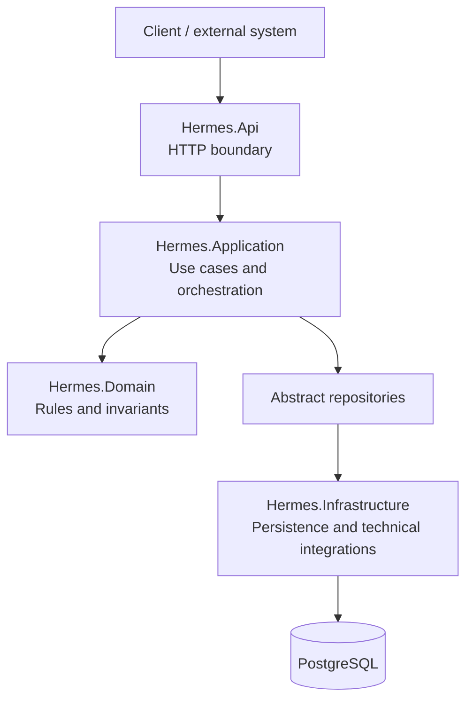

# Hermes

> Entry and coordination module of Pantheon: it exposes APIs, orchestrates use cases, applies domain rules through dedicated layers, and persists the operational state.

## Table of contents

- [Overview](#overview)
- [Responsibilities](#responsibilities)
- [Layered architecture](#layered-architecture)
- [Full flow](#full-flow)
- [Persistence](#persistence)
- [Local development and debugging](#local-development-and-debugging)
- [Layer documentation](#layer-documentation)
- [Principles](#principles)

---

## Overview

Hermes is the module that represents the operational boundary between Pantheon and clients or external systems. It receives HTTP requests, validates inbound contracts, identifies clients, operation types, endpoints, resolves configured routes, and coordinates the execution lifecycle.

The module deliberately separates protocol, application, domain, and technology. Each layer has a precise responsibility and communicates through explicit contracts and abstractions.



## Responsibilities

Hermes manages:

- HTTP contracts and uniform responses;
- validation of requests at the application boundary;
- management of clients, operation types, endpoints, and routes;
- creation and progression of operations;
- execution, execution steps, and data packages;
- correlation through correlation ID, operation ID, and execution ID;
- persistent access to the model through repositories;
- centralized translation of application, domain, and technical errors.

Hermes does not place business rules in controllers, does not expose domain entities directly, and does not bind the domain to PostgreSQL, Entity Framework, or ASP.NET Core.

## Layered architecture

### Hermes.Api — HTTP entry

`Hermes.Api` is the presentation layer. It exposes the REST controllers and adapts the HTTP protocol to the application contracts.

Main responsibilities:

- define routes, HTTP verbs, and request/response models;
- validate input using FluentValidation;
- convert HTTP requests into application commands/queries;
- invoke the use cases in the application layer;
- convert application DTOs into HTTP responses;
- transform exceptions into consistent HTTP responses;
- propagate the request `CancellationToken`.

The API layer does not access `DbContext` or SQL directly and does not implement domain invariants.

### Hermes.Application — use case orchestration

`Hermes.Application` contains the application behavior: it decides which operations to execute and in what order, without knowing HTTP or the persistence provider.

Main responsibilities:

- define commands, queries, and use cases;
- coordinate query and command handlers;
- retrieve entities through abstract repositories;
- apply application-level checks, such as missing or duplicate resources;
- invoke methods on domain entities;
- return application DTOs;
- expose typed application exceptions.

The application layer depends on `Hermes.Domain`, but not on `Hermes.Infrastructure` as an implementation detail.

### Hermes.Domain — model and business rules

`Hermes.Domain` is the core of the module. It defines what Hermes represents and which transitions are allowed, without knowing about databases, HTTP, brokers, or external SDKs.

It includes:

- configuration entities: `Client`, `OperationType`, `Endpoint`, `Route`;
- runtime entities: `Operation`, `Execution`, `ExecutionStep`;
- payloads: `Package`, `Data`, `Header`, `Metadata`;
- value objects and state enumerations;
- invariants and state transitions;
- repository interfaces;
- domain exceptions.

The domain owns the rules: outer layers can orchestrate or translate them, but not duplicate them.

### Hermes.Infrastructure — persistence and technical details

`Hermes.Infrastructure` implements the technical details required by the internal layers:

- `HermesDbContext` and Entity Framework Core configurations;
- PostgreSQL provider via Npgsql;
- concrete repositories for queries and commands;
- schema migrations;
- relational mapping and entity tracking.

This layer depends on the domain and application layers to implement the required abstractions, but EF Core and PostgreSQL details do not rise back to the domain.

## Full flow

```text
HTTP request
  → Hermes.Api: binding and validation
  → Application request mapper: command/query
  → Hermes.Application: use case
  → Abstract repository: read or write
  → Hermes.Infrastructure: EF Core / PostgreSQL
  → Hermes.Domain: invariants and transitions
  → Application DTO
  → ResponseMapper
  → HTTP response
```

For a command, the application layer retrieves the required resources, invokes the appropriate domain method, and delegates persistence to the repository. For a query, it retrieves data and converts it to a DTO without modifying state.

## Persistence

Hermes uses Entity Framework Core with PostgreSQL via Npgsql. The connection string is configured with the `ConnectionStrings__Hermes` key, and the context is registered at startup in `Hermes.Api`.

Migrations are versioned in `Hermes.Infrastructure/Migrations`; entity configurations are in `Hermes.Infrastructure/Persistence/Configurations`. In local environments, PostgreSQL is started by the Docker Compose stack and data is stored in the `pantheon-postgres-data` volume.

For configuration and stack startup, consult [`infra/local/README.md`](../../infra/local/README.md).

## Local development and debugging

From the repository root:

```bash
./scripts/pantheon.sh local db-up
./scripts/pantheon.sh local dev-up
```

To run Hermes directly:

```bash
dotnet restore Pantheon.slnx
dotnet build Pantheon.slnx
dotnet run --project src/Hermes/Hermes.Api/Hermes.Api.csproj
```

To start all services and open the VS Code windows linked to the Dev Containers:

```bash
./scripts/pantheon.sh local debug-all
```

The Hermes Dev Container mounts the repository root in `/workspace`. The endpoints exposed directly by the Development profile remain `http://localhost:5080` and `https://localhost:7138`; when Hermes runs in Docker, use the host port configured in `infra/local/.env`.

## Layer documentation

The detailed documentation is maintained in the README files of the individual projects:

- [`Hermes.Api.ReadMe.md`](Hermes.Api/Hermes.Api.ReadMe.md) — controllers, request/response mapping, validation, and error handling;
- [`Hermes.Application.ReadMe.md`](Hermes.Application/Hermes.Application.ReadMe.md) — use cases, commands, queries, DTOs, and application exceptions;
- [`Hermes.Domain.ReadMe.md`](Hermes.Domain/Hermes.Domain.ReadMe.md) — entities, value objects, states, repositories, and domain exceptions;
- [`Hermes.Infrastructure.ReadMe.md`](Hermes.Infrastructure/Hermes.Infrastructure.ReadMe.md) — DbContext, PostgreSQL, repositories, configurations, and migrations.

## Principles

1. **Separate responsibilities** — each layer has a clear boundary.
2. **Dependencies point inward** — the domain does not depend on frameworks or infrastructure.
3. **Thin controllers** — the API coordinates, but does not implement business logic.
4. **Explicit use cases** — the application orchestrates the flows.
5. **Domain owns invariants** — transitions are protected by entities.
6. **Abstract repositories** — the domain does not know EF Core or SQL.
7. **Persistence isolated** — PostgreSQL and migrations remain in Infrastructure.
8. **Distinct contracts** — HTTP requests/responses, commands, queries, and DTOs are not confused.
9. **Uniform errors** — each boundary translates errors into its own contract.
10. **Asynchronous and cancellation-aware** — flows propagate `CancellationToken`.
