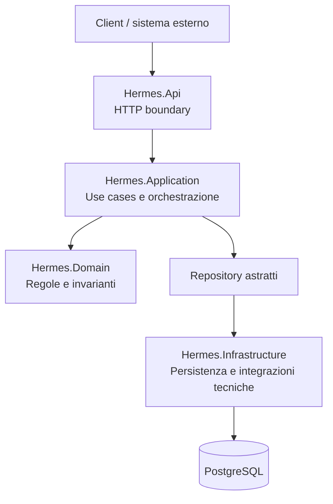

# Hermes

> Modulo di ingresso e coordinamento di Pantheon: espone le API, orchestra i casi d'uso, applica le regole di dominio attraverso i layer dedicati e persiste lo stato operativo.

## Indice

- [Panoramica](#panoramica)
- [Responsabilità](#responsabilità)
- [Architettura a layer](#architettura-a-layer)
- [Flusso completo](#flusso-completo)
- [Persistenza](#persistenza)
- [Sviluppo locale e debug](#sviluppo-locale-e-debug)
- [Documentazione dei layer](#documentazione-dei-layer)
- [Principi](#principi)

---

## Panoramica

Hermes è il modulo che rappresenta il confine operativo tra Pantheon e i client o sistemi esterni. Riceve richieste HTTP, valida i contratti in ingresso, identifica client, operation type, endpoint e route, crea o aggiorna le operation e coordina il relativo ciclo di esecuzione.

Il modulo separa deliberatamente protocollo, applicazione, dominio e tecnologia. Ogni layer ha una responsabilità precisa e comunica con gli altri attraverso contratti e astrazioni esplicite.



## Responsabilità

Hermes gestisce:

- contratti HTTP e risposte uniformi;
- validazione delle request al bordo dell'applicazione;
- gestione di client, operation type, endpoint e route;
- creazione e avanzamento delle operation;
- execution, execution step e package di dati;
- correlazione tramite correlation ID, operation ID ed execution ID;
- accesso persistente al modello tramite repository;
- traduzione centralizzata degli errori applicativi, di dominio e tecnici.

Hermes non contiene nei controller le regole di business, non espone direttamente le entità del dominio e non lega il dominio a PostgreSQL, Entity Framework o ASP.NET Core.

## Architettura a layer

### Hermes.Api — ingresso HTTP

`Hermes.Api` è il presentation layer. Espone i controller REST e adatta il protocollo HTTP ai contratti applicativi.

Responsabilità principali:

- definire route, verbi HTTP e modelli request/response;
- validare gli input con FluentValidation;
- convertire request HTTP in command/query;
- invocare i casi d'uso dell'application layer;
- convertire i DTO applicativi in response HTTP;
- trasformare le eccezioni in risposte HTTP coerenti;
- propagare il `CancellationToken` della richiesta.

Il layer API non accede direttamente a `DbContext` o SQL e non implementa invarianti di dominio.

### Hermes.Application — orchestrazione dei casi d'uso

`Hermes.Application` contiene il comportamento applicativo: decide quali operazioni eseguire e in quale ordine, senza conoscere HTTP o il provider di persistenza.

Responsabilità principali:

- definire command, query e use case;
- coordinare query e command handler;
- recuperare le entità attraverso i repository astratti;
- applicare verifiche applicative, come risorsa non trovata o duplicata;
- invocare i metodi delle entità di dominio;
- restituire DTO applicativi;
- esporre eccezioni applicative tipizzate.

L'application layer dipende da `Hermes.Domain`, ma non da `Hermes.Infrastructure` come dettaglio implementativo.

### Hermes.Domain — modello e regole di business

`Hermes.Domain` è il cuore del modulo. Definisce cosa rappresenta Hermes e quali transizioni sono ammesse, senza conoscere database, HTTP, broker o SDK esterni.

Comprende:

- entità di configurazione: `Client`, `OperationType`, `Endpoint`, `Route`;
- entità runtime: `Operation`, `Execution`, `ExecutionStep`;
- payload: `Package`, `Data`, `Header`, `Metadata`;
- value object ed enumerazioni di stato;
- invarianti e transizioni di stato;
- interfacce dei repository;
- eccezioni di dominio.

Il dominio è proprietario delle regole: i layer esterni possono orchestrare o tradurre, ma non duplicare tali regole.

### Hermes.Infrastructure — persistenza e dettagli tecnici

`Hermes.Infrastructure` implementa i dettagli tecnici richiesti dai layer interni:

- `HermesDbContext` e configurazioni Entity Framework Core;
- provider PostgreSQL tramite Npgsql;
- repository concreti per query e command;
- migration dello schema;
- mapping relazionale e tracking delle entità.

Questo layer dipende dal dominio e dall'application layer per implementare le astrazioni richieste, ma i dettagli di EF Core e PostgreSQL non risalgono verso Domain.

## Flusso completo

```text
HTTP request
  → Hermes.Api: binding e validazione
  → RequestMapper: command/query applicativa
  → Hermes.Application: use case
  → Repository astratto: lettura o scrittura
  → Hermes.Infrastructure: EF Core / PostgreSQL
  → Hermes.Domain: invarianti e transizioni
  → DTO applicativo
  → ResponseMapper
  → HTTP response
```

Per una command, l'application layer recupera le risorse necessarie, invoca il metodo di dominio appropriato e delega la persistenza al repository. Per una query, recupera i dati e li converte in DTO senza modificare lo stato.

## Persistenza

Hermes usa Entity Framework Core con PostgreSQL tramite Npgsql. La connection string è configurata con la chiave `ConnectionStrings__Hermes` e il contesto viene registrato all'avvio di `Hermes.Api`.

Le migration sono versionate in `Hermes.Infrastructure/Migrations`; le configurazioni delle entità si trovano in `Hermes.Infrastructure/Persistence/Configurations`. In locale PostgreSQL è avviato dallo stack Docker Compose e i dati sono conservati nel volume `pantheon-postgres-data`.

Per la configurazione e l'avvio dello stack consultare [`infra/local/README.md`](../../infra/local/README.md).

## Sviluppo locale e debug

Dalla root del repository:

```bash
./scripts/pantheon.sh local db-up
./scripts/pantheon.sh local dev-up
```

Per eseguire Hermes direttamente:

```bash
dotnet restore Pantheon.slnx
dotnet build Pantheon.slnx
dotnet run --project src/Hermes/Hermes.Api/Hermes.Api.csproj
```

Per avviare tutti i servizi e aprire le finestre VS Code collegate ai Dev Container:

```bash
./scripts/pantheon.sh local debug-all
```

Il Dev Container di Hermes monta la root del repository in `/workspace`. Gli endpoint esposti direttamente dal profilo Development restano `http://localhost:5080` e `https://localhost:7138`; quando Hermes gira in Docker, usare la porta host configurata in `infra/local/.env`.

## Documentazione dei layer

La documentazione dettagliata è mantenuta nei README dei singoli progetti:

- [`Hermes.Api.ReadMe.md`](Hermes.Api/Hermes.Api.ReadMe.md) — controller, request/response, mapping, validazione ed error handling;
- [`Hermes.Application.ReadMe.md`](Hermes.Application/Hermes.Application.ReadMe.md) — use case, command, query, DTO ed eccezioni applicative;
- [`Hermes.Domain.ReadMe.md`](Hermes.Domain/Hermes.Domain.ReadMe.md) — entità, value object, stati, repository ed eccezioni di dominio;
- [`Hermes.Infrastructure.ReadMe.md`](Hermes.Infrastructure/Hermes.Infrastructure.ReadMe.md) — DbContext, PostgreSQL, repository, configurazioni e migration.

## Principi

1. **Responsabilità separate** — ogni layer ha un confine chiaro.
2. **Dipendenze verso l'interno** — Domain non dipende da framework o infrastruttura.
3. **Controller sottili** — API coordina, non implementa business logic.
4. **Use case espliciti** — Application orchestra i flussi applicativi.
5. **Dominio proprietario delle invarianti** — le transizioni sono protette dalle entità.
6. **Repository astratti** — il dominio non conosce EF Core o SQL.
7. **Persistenza isolata** — PostgreSQL e migration restano in Infrastructure.
8. **Contratti distinti** — HTTP request/response, command/query e DTO non vengono confusi.
9. **Errori uniformi** — ogni confine traduce gli errori nel proprio contratto.
10. **Asincronia e cancellazione** — i flussi propagano `CancellationToken`.

